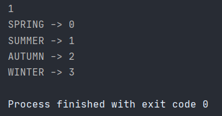
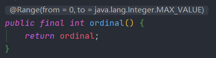
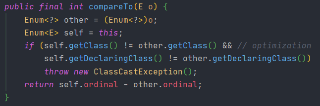
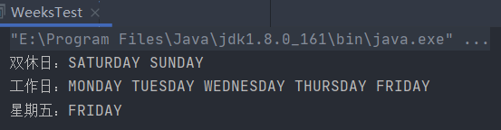

# 一、什么是枚举

**枚举**大概可以理解为穷举，就是把可数的集合元素一一列举出来。

Java 5.0引入了枚举，枚举限制变量只能是预先设定好的值。

使用枚举可以减少代码中的 bug，方便很多场景使用。

# 二、枚举的优势

枚举相比于通过`static final`定义的常量有哪些优势呢？

举个例子。

我们定义周一到周日这7个常量，可以用7个不同的`int`表示：

```java
public class Weekday {
    public static final int SUN = 0;
    public static final int MON = 1;
    public static final int TUE = 2;
    public static final int WED = 3;
    public static final int THU = 4;
    public static final int FRI = 5;
    public static final int SAT = 6;
}
```

使用常量的时候，可以这么引用：

```java
if (day == Weekday.SAT || day == Weekday.SUN) {
    // TODO: work at home
}
```

无论是`int`常量还是`String`常量，使用这些常量来表示一组枚举值的时候，有一个严重的问题就是：

**编译器无法检查每个值的合理性。**

例如：

```java
if (weekday == 6 || weekday == 7) {
    if (tasks == Weekday.MON) {
        // TODO:
    }
}
```

上述代码编译和运行均不会报错，但存在两个问题：

- 注意到`Weekday`定义的常量范围是`0`~`6`，并不包含`7`，编译器无法检查不在枚举中的`int`值；
- 定义的常量仍可与其他变量比较，但其用途并非是枚举星期值。

---

和`int`定义的常量相比，使用`enum`定义枚举有如下好处：

首先，`enum`常量本身带有类型信息，即`Weekday.SUN`类型是`Weekday`，编译器会自动检查出类型错误。例如，下面的语句不可能编译通过：

```java
int day = 1;
if (day == Weekday.SUN) { // Compile error: bad operand types for binary operator '=='
}
```

其次，不可能引用到非枚举的值，因为无法通过编译。

最后，不同类型的枚举不能互相比较或者赋值，因为类型不符。

例如，不能给一个`Weekday`枚举类型的变量赋值为`Color`枚举类型的值：

```java
Weekday x = Weekday.SUN; // ok!
Weekday y = Color.RED; // Compile error: incompatible types
```

这就使得编译器可以在编译期自动检查出所有可能的潜在错误。

# 三、Java枚举的语法

**枚举类中的声明** 

```java
访问修辞符 enum 枚举名 {
    枚举成员,
    枚举成员,
    ...
};
```

**class类中枚举的声明** 

```java
访问修饰符 class 类名 {
    enum 枚举名 {
        枚举成员,
        枚举成员,
        ...
    }
}
```


# 四、枚举类的使用规则

- **类的对象是确定的有限个数。**  
- **枚举类不能被继承** 
- **不能通过new关键字创建枚举类对象** 
- **枚举类中的枚举成员是用`,`隔开的，最后以`;`结束。** 


# 五、应用场景

- **星期：** Monday（星期一）、Tuesday（星期二）、Wednesday（星期三）、Thursday（星期四）、Firday（星期五）、Saturday（星期六）、Sunday（星期日）
- **性别：** Man（男）、Woman（女）
- **季节：** Spring（春天）、Summer（夏天）、Autumn（秋天）、Winter（冬天）
- **支付方式：** Cash（现金）、WeChatPay（微信）、Alipay（支付宝）、BankCard（银行卡）、CreditCard（信用卡）
- **订单状态：** Nonpayment（未付款）、Paid（已付款）、Fulfilled（已配货）、Delivered（已发货）、Return（退货）、Checked（已确认）
- **线程状态：** Establish（创建）、Ready（就绪）、Run（运行）、Obstruct（阻塞）、Die（死亡）
- 等等......


# 六、枚举类的使用步骤

我们以奶茶的大、中、小杯为三种杯型创建枚举类。

```java
/**
 * 为珍珠奶茶添加三个杯型：大、中、小
 */
public enum PearlMilkTea {
    SMALL, MEDIUM, LARGE
}
```

其次，创建珍珠奶茶对象，再有方法来判断枚举类中的大、中、小杯。

```java
public class PearlMilkTeaTest {
    public static void main(String[] args) {
        //创建大杯的珍珠奶茶对象
        PearlMilkTea pearlMilkTea = PearlMilkTea.LARGE;
        PearlMilkTeaTest.drinkSize(pearlMilkTea);
    }

    public static void drinkSize(PearlMilkTea pearlMilkTea) {
        if (pearlMilkTea == PearlMilkTea.LARGE) {
            System.out.println("买了大杯珍珠奶茶！");
        } else if (pearlMilkTea == PearlMilkTea.MEDIUM) {
            System.out.println("买了中杯珍珠奶茶！");
        } else {
            System.out.println("买了小杯珍珠奶茶！");
        }
    }
}
```


# 七、有参枚举类

```java
public enum Season {
    SPRING("春天"),
    SUMMER("夏天"),
    AUTUMN("秋天"),
    WINTER("冬天");

    private final String seasonName;

    Season1(String seasonName) {
        this.seasonName = seasonName;
    }

    public String getSeasonName() {
        return seasonName;
    }
}
```

创建了该枚举类的测试类：

```java
public class SeasonTest {
    public static void main(String[] args) {
        Season1 spring = Season.SPRING;
        System.out.println(spring);                     //SPRING
        System.out.println(spring.getSeasonName());     //春天
    }
}
```


# 八、Enum常用方法的使用

## 8.1 name()和toString()

name()就是根据枚举成员来获取该枚举成员的字符串名称。而同String方法也是用来获取枚举成员的字符串名称。

```java
System.out.println(Season.SUMMER.name());			//SUMMER
System.out.println(Season.SUMMER.toString());		//SUMMER
```


## 8.2 valueOf()

根据枚举成员名称获取枚举成员。

```
System.out.println(Season.valueOf("WINTER"));			//WINTER
System.out.println(Season.valueOf("WIN"));				//java.lang.IllegalArgumentException
```


## 8.3 values

获取枚举成员的所有值，这些值并以数组的形式存储。

```java
Season[] seasons = Season.values();
for (Season season : seasons) {
    System.out.print(season + " ");
}
```

**结果为：** 

```java
SPRING SUMMER AUTUMN WINTER 
```


## 8.4 ordinal

> 该方法是获取枚举成员的序数，其第一个枚举成员位置为0。其实，为了好理解的话，可以把它看作数组中的索引。数组中的第一个元素位置同样也是从0开始。那我们打印一下，看看结果如何，如下：

```java
//获取指定枚举成员的次序
System.out.println(Season.SUMMER.ordinal());

//获取所有成员的次序
Season[] seasons = Season.values();
for (Season s : seasons) {
    System.out.println(s + " -> " + s.ordinal());
}
```

**结果为：** 



其源码就是返回了一个从0开始int类型的值，从源码中也可以看出最大值是int取值范围的最大值。如下：




## 6.6 compareTo

> compareTo方法相信我们已经是很熟悉了。其作用就是用来比较的。但是在枚举类中它比较的是什么呢？实际上compareTo方法比较的是两个枚举成员的次序数，并返回次序相减后的结果。

首先，我们要知道SUMMER的次序数为1，WINTER的次序数为3。当使用前者比较后者，打印的结果是前者与后者相减后的差值，即`1-3=-2`

```java
System.out.println(Season.SUMMER.compareTo(Season.WINTER));			//-2
```

它的源码是怎么做的呢？那我们进入查看一下。

其中，前面的操作都是在判断比较的双方是否是一个枚举类，如果不是的话就抛出异常。如果为枚举类的话，就直接将次序数做了相减操作并返回。




# 七、Java枚举的高级特性

## 7.1 常量

> 我们知道，常量是用`public static final`修饰的。1.5之后有了枚举，我们就可以把相关的常量放在一个枚举容器中，而且使用枚举的好处还在于枚举为我们提供了很多便捷的的方法。

*示例：* 

```java
public enum Season {
    SPRING, SUMMER, AUTUMN, WINTER
}
```


## 7.2 switch语句

> 你了解的switch语句都支持哪种类型呢？我这里说一下，switch语句支持的类型有如下几种：
>
> - **基本数据类型：** byte、short、char、int
> - **包装数据类型：** Byte、Short、Character、Integer
> - **枚举类型：** Enum
> - **字符串类型：** String（jdk7+ 开始支持）
>
> 具体枚举类与switch语句的使用是如何实现呢？枚举又是如何为switch语句提供便利的呢？来看一下吧。

```java
package com.mylifes1110.java;

public class WeekTest {
    public static void main(String[] args) {
        Week week = Week.MONDAY;
        switch (week) {
            case MONDAY:
                System.out.println("星期一");
                break;
            case TUESDAY:
                System.out.println("星期二");
                break;
            case WEDNESDAY:
                System.out.println("星期三");
                break;
            case THURSDAY:
                System.out.println("星期四");
                break;
            case FRIDAY:
                System.out.println("星期五");
                break;
            case SATURDAY:
                System.out.println("星期六");
                break;
            case SUNDAY:
                System.out.println("星期日");
                break;
            default:
                System.out.println("null");
        }
    }
}

enum Week {
    MONDAY, TUESDAY, WEDNESDAY, THURSDAY, FRIDAY, SATURDAY, SUNDAY
}
```


## 7.3 枚举中定义多个参数与方法

> 有参枚举在5.2中我已经做了详细说明，我们在定义枚举时不只是可以定义多个参数，还可以定义其他的普通方法来使用，而关于普通方法的使用是根据场景的，这里我就不再做过多的赘述了。

```java
package com.mylifes1110.java;

public enum Season {
    SPRING("春天"),
    SUMMER("夏天"),
    AUTUMN("秋天"),
    WINTER("冬天");

    private final String seasonName;
    
    public static String getName(int index) {  
        for (Season s : Season.values()) {  
            if (c.getIndex() == index) {  
                return c.name;  
            }  
        }  
        return null;  
    }

    Season1(String seasonName) {
        this.seasonName = seasonName;
    }

    public String getSeasonName() {
        return seasonName;
    }
}
```


## 7.4 枚举类实现接口

> 虽然枚举类不能继承，但是可以实现接口。以下是一个实现过程。

首先，创建一个接口。

```java
package com.mylifes1110.inter;

public interface Show {
    void show();
}
```

其次，让我们的四季枚举类实现该接口并重写方法。

```java
package com.mylifes1110.java;

import com.mylifes1110.inter.Show;

public enum Season implements Show {
    SPRING("春天"),
    SUMMER("夏天"),
    AUTUMN("秋天"),
    WINTER("冬天");

    private final String seasonName;

    Season1(String seasonName) {
        this.seasonName = seasonName;
    }

    public String getSeasonName() {
        return seasonName;
    }

    @Override
    public void show() {
        System.out.println("向往四季如春");
    }
}
```

最后，当我们使用每一个枚举类都可以调用show方法，而打印的结果也都是“向往四季如春”

```java
Season.WINTER.show();				//向往四季如春
```

*聪明的你我相信发现了这个缺点，我们不管使用哪一个枚举成员时，调用的show方法都是同一个。所以，我们在实现接口后，可以这样重写方法，如下：* 

```java
package com.mylifes1110.java;

import com.mylifes1110.inter.Show;

public enum Season1 implements Show {
    SPRING("春天") {
        @Override
        public void show() {
            System.out.println("春天是个踏青的季节");
        }
    },
    SUMMER("夏天") {
        @Override
        public void show() {
            System.out.println("夏天是个炎热的季节,我要吃冰棍");
        }
    },
    AUTUMN("秋天") {
        @Override
        public void show() {
            System.out.println("秋天还算是凉爽");
        }
    },
    WINTER("冬天") {
        @Override
        public void show() {
            System.out.println("冬天的雪还不错,就是有点冷");
        }
    };

    private final String seasonName;

    Season1(String seasonName) {
        this.seasonName = seasonName;
    }

    public String getSeasonName() {
        return seasonName;
    }
}
```

我们在枚举成员的后面加了`{}`，而重写的方法可以写在各个枚举成员中，这样就接触了上述所有的那个限制。这下，我们使用哪个枚举成员对象调用show方法都是不同的。是不是非常NICE？


## 7.5 使用接口对枚举分类

> 使用接口对枚举分类，我们需要创建一个接口容器，里面存放着此接口容器所存放的多个枚举类，然后将各个枚举类实现此接口，以这样的方式可实现对枚举分类。代码如下，打印结果放在了代码后面的注释中：

```java
package com.mylifes1110.inter;

public interface Weeks {
    //工作日
    enum WorkingDay implements Weeks {
        MONDAY, TUESDAY, WEDNESDAY, THURSDAY, FRIDAY
    }

    //双休日
    enum Weekend implements Weeks {
        SATURDAY, SUNDAY
    }
}

class WeeksTest {
    public static void main(String[] args) {
        System.out.print("双休日：");
        for (Weeks.Weekend weekend : Weeks.Weekend.values()) {
            System.out.print(weekend + " ");        //双休日：SATURDAY SUNDAY
        }

        //换行
        System.out.println();

        System.out.print("工作日：");
        for (Weeks.WorkingDay workingDay : Weeks.WorkingDay.values()) {
            System.out.print(workingDay + " ");     //工作日：MONDAY TUESDAY WEDNESDAY THURSDAY FRIDAY
        }

        //换行
        System.out.println();

        Weeks.WorkingDay friday = Weeks.WorkingDay.FRIDAY;
        System.out.println("星期五：" + friday);      //星期五：FRIDAY
    }
}
```




# 八 枚举类集合

## 8.1 EnumSet集合

> 关于Set集合，我们知道其集合中的元素是不重复的。其中的方法有以下几种：

| 返回值                                    | 方法                          | 描述                                                         |
| ----------------------------------------- | ----------------------------- | ------------------------------------------------------------ |
| static <E extends Enum\<E>> EnumSet\<E>   | allOf(Class\<E> elementType)  | 创建一个包含指定元素类型的所有元素的枚举 set。               |
| EnumSet\<E>                               | clone()                       | 返回一个set集合。                                            |
| static <E extends Enum\<E>> EnumSet\<E>   | complementOf(EnumSet\<E> s)   | 创建一个其元素类型与指定枚举set相同的set集合（新集合中包含原集合所不包含的枚举成员） |
| static <E extends Enum\<E>> EnumSet\<E>   | copyOf(EnumSet\<E> s)         | 创建一个其元素类型与指定枚举 set 相同的枚举 set集合（新集合中包含与原集合相同的枚举成员） |
| static <E extends Enum\<E>> EnumSet\<E>   | copyOf(Collection\<E> s)      | 创建一个从指定 collection 初始化的枚举 set                   |
| static <E extends Enum\<E>> EnumSet\<E>   | noneOf(Class\<E> elementType) | 创建一个具有指定元素类型的空枚举 set                         |
| static <E extends Enum\<E>> EnumSet\<E>   | range(E from, E to)           | 创建一个最初包含由两个指定端点所定义范围内的所有元素的枚举 set。 |
|                                           |                               |                                                              |
| static   <E extends Enum\<E>> EnumSet\<E> | of                            | 创建一个最初包含指定元素的枚举 set。注意：可以指定多个元素，所以在这里我没有列举参数 |


### 8.1.1 allOf

> allOf方法需要我们传入一个枚举的类对象，它会根据传入的枚举类对象生成一个具有该类对象枚举成员的Set集合。

```java
//创建一个包含Week所有枚举元素的Set集合
EnumSet<Week> weeks = EnumSet.allOf(Week.class);
System.out.println(weeks);              //[MONDAY, TUESDAY, WEDNESDAY, THURSDAY, FRIDAY, SATURDAY, SUNDAY]

//打印Set集合中的元素
for (Week week1 : weeks) {
    System.out.print(week1 + " ");      //MONDAY TUESDAY WEDNESDAY THURSDAY FRIDAY SATURDAY SUNDAY
}
```


### 8.1.2 clone

> clone方法与直接打印枚举的Set集合结果相同！

```java
//返回一个Set集合
System.out.println(weeks.clone());      //[MONDAY, TUESDAY, WEDNESDAY, THURSDAY, FRIDAY, SATURDAY, SUNDAY]
```


### 8.1.3 range

> 上面详细讲过枚举是有序数的，而且枚举类中的枚举成员是秉承着从左向右的顺序。所以我们可以使用range方法来创建指定枚举成员端点的Set集合，也就是说我们需要传入枚举成员的起始与结束去创建一个该拥有该范围枚举成员的Set集合。如下：

```java
//创建一个最初包含由两个指定端点所定义范围内的所有元素的枚举 set。
System.out.println(EnumSet.range(Week.MONDAY, Week.FRIDAY));        //[MONDAY, TUESDAY, WEDNESDAY, THURSDAY, FRIDAY]
```


### 8.1.4 complementOf

> 该方法有点特殊，它根据EnumSet去创建一个新Set集合。而新Set集合中枚举成员相当于旧Set集合中枚举成员的取反。
>
> 我们用场景来模拟一下，当前Week枚举类中有星期一到星期日7个枚举成员。我们使用range方法创建一个从星期一到星期五的Set集合（s1），随后我在将使用complementOf方法根据s1生成新的Set集合（s2），最后打印s2查看集合中的元素就只有星期六和星期日。
>
> **注意：** 如果我们的旧Set集合占据了枚举类中的所有枚举成员，在使用complementOf方法生成的新Set集合，新集合中的元素打印后为空Set，即`[]`。

```java
//创建一个其元素类型与指定枚举set相同的set集合（新集合中包含原集合所不包含的枚举成员）
EnumSet<Week> weeks1 = EnumSet.complementOf(weeks);
System.out.println(weeks1);             //[]

EnumSet<Week> range = EnumSet.range(Week.MONDAY, Week.FRIDAY);
EnumSet<Week> weeks3 = EnumSet.complementOf(range);
System.out.println(weeks3);    			//[SATURDAY, SUNDAY]
```


### 8.1.5 copyOf

> copyOf方法与complementOf相反，它创建一个新Set集合。而新Set集合中的枚举成员与旧Set集合中的枚举成员相同，这相当于就是Copy（复制功能）。如果你理解了complementOf方法，这个方法对你来说也是没有挑战。以下我使用copyOf方法复制了一份weeks，其枚举成员一个不少。
>
> **注意：** copyOf方法还有一个可以复制connection集合来创建Set集合，其connection集合中必须存储的是枚举成员。

```java
//创建一个其元素类型与指定枚举 set 相同的枚举 set集合（新集合中包含与原集合相同的枚举成员）
EnumSet<Week> weeks2 = EnumSet.copyOf(weeks);
System.out.println(weeks2);             //[MONDAY, TUESDAY, WEDNESDAY, THURSDAY, FRIDAY, SATURDAY, SUNDAY]
```

```java
//复制存储枚举成员的HashSet集合
Set set = new HashSet();
set.add(Week.MONDAY);
EnumSet set1 = EnumSet.copyOf(set);
System.out.println(set1);		//[MONDAY]
```


### 8.1.6 of

> of方法为我们提供了选择性的便利，我们可以挑选任意枚举成员成为Set集合的元素。

```java
//创建一个最初包含指定元素的枚举 set。
System.out.println(EnumSet.of(Week.MONDAY,Week.FRIDAY));            //[MONDAY, FRIDAY]
```


### 8.1.7 noneOf

> 传入一个枚举的类对象去创建一个空Set集合

```java
EnumSet<Week> noneOf = EnumSet.noneOf(Week.class);
System.out.println(noneOf);                     //[]
```


## 8.2 EnumMap集合

### 8.2.1 EnumMap集合的方法列表

> 关于Map集合，我们知道它是由键和值组成。EnumMap集合与HashMap集合的效率比较来说，EnumMap的效率高些。

关于EnumMap集合的使用与HashMap是一致的，没有什么特殊的。至于EnumMap集合的方法，我这里列举一下。

| 返回值              | 方法                                   | 描述                                         |
| ------------------- | -------------------------------------- | -------------------------------------------- |
| void                | clear()                                | 移除所有映射关系。                           |
| EnumMap<K,V>        | clone()                                | 返回EnumMap集合。                            |
| boolean             | containsKey(Object key)                | 包含此键，则返回true                         |
| boolean             | containsValue(Object value)            | 包含一个或多个键映射到的该指定值，则返回true |
| Set<Map.Entry<K,V>> | entrySet()                             | 返回映射键值关系的Set集合                    |
| boolean             | equals(Object o)                       | 比较对象与映射的相等关系                     |
| V                   | get(Object key)                        | 获取指定键映射的值，如果没有，返回null       |
| Set\<K>             | keySet()                               | 返回所有键的Set集合                          |
| V                   | put(K key, V value)                    | 将指定键值存储在EnumMap集合中                |
| void                | putAll(Map<? extends K,? extends V> m) | 将所有键值对存储在集合中                     |
| V                   | remove(Object key)                     | 如果存在映射关系，则移除该映射关系           |
| int                 | size()                                 | 返回存在映射关系的数量                       |
| Collection\<V>      | values()                               | 返回此映射中所包含值的 Collection集合        |


### 8.2.2 EnumMap集合的基本使用

> 由于EnumMap集合与HashMap集合基本相似，这里我就演示一下基本使用与HashMap不同的地方。

EnumMap集合是我们new出来的对象，创建出来的对象需要传入一个枚举的类对象，才返回一个Map集合。Map集合是键值对形式存储，所以我们在写EnumMap集合的泛型时，根据需求来写，如果需要键是某枚举类型，我们泛型就写它。如果有枚举类是值的要求，那就泛型中的值写枚举类。键值对都要求是枚举那也是OK的，我们写泛型时都写需求的枚举类即可。除了创建对象和存储对象需要指定枚举类外，其他的与HashMap基本相同。

如下，我在创建EnumMap集合时执行的Week枚举类的类对象，泛型的键写的是Week枚举类，值写的Integer，这就意味着我们在put（存储键值对）的时候，键需要存储Week枚举类中的枚举成员，值需要存储Integer数值。

```java
EnumMap<Week, Integer> map = new EnumMap<>(Week.class);
map.put(Week.MONDAY, 1);
map.put(Week.THURSDAY, 4);
System.out.println(map);			//{MONDAY=1, THURSDAY=4}
```


> 上一章[【Java注解】](https://github.com/Ziphtracks/JavaLearningmanual/blob/master/docs/Java-Standard-Edition/Java注解.md)

> JavaSE基础内容就此完结！感谢大家阅读！