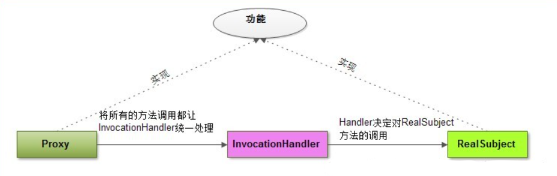

学习动态代理之前我们需要一些前置知识点：

[[学一点关于JVM类加载的知识]]

[[Java反射，看完就会用]]


然后我们从设计模式中的[[**代理模式**]]开始说。

# 代理模式

代理模式中有3个角色：

- **Subject抽象角色**：负责定义RealSubject和Proxy应该实现的接口。
- **RealSubject真实角色**：真正完成业务服务功能。
- **Proxy代理角色**：包含对RealSubject的引用，自己不做业务。

代理模式在实际生活中的应用实例有：明星经纪人、租房中介等等。

代理模式又分为**静态代理**和**动态代理**。

## 静态代理

代理我们大概知道什么意思了，那静态是什么意思？

静态就是说我们的代理类都在程序员编码阶段就已经实现了，通过编译器后可以直接编译成class文件然后加载到JVM内存，程序运行时，class就已经存在了。

下面给出一个代码示例来了解静态代理模式：

 将车站的售票服务抽象出一个接口 TicketService ,包含问询，卖票，退票功能，车站类 Station 实现了 TicketService 接口，车票代售点 StationProxy 则实现了代理角色的功能。

TicketService抽象角色：

````java
public interface TicketService {
    public void sellTicket();

    public void inquire();

    public void withdraw();
}
````

Station真实角色：

````java
public class Station implements TicketService{
    @Override
    public void sellTicket() {
        System.out.println("\n\t售票...\n");
    }
    
    @Override
    public void inquire() {
        System.out.println("\n\t问询...\n");

    }
    
    @Override
    public void withdraw() {
        System.out.println("\n\t退票...\n");

    }
}
````

StationProxy 代理角色：

````java
public class StationProxy implements TicketService{

    private Station station;

    public StationProxy(Station station) {
        this.station = station;
    }

    @Override
    public void sellTicket() {
        // 1.做真正业务之前提示信息
        this.showAlertInfo("===您正在使用车票代售点进行购票，每张票会收取5元手续费！===");
        // 2.调用真实业务逻辑
        station.sellTicket();
        // 3.后处理
        this.takeHandlingFee();
        this.showAlertInfo("===感谢您的光临，再见！===");
    }

    @Override
    public void inquire() {
        // 1做真正业务前，提示信息
        this.showAlertInfo("===欢迎光临本代售点，问询服务不会收取任何费用，本问询信息仅供参考，具体信息以车站真实数据为准！===");
        // 2.调用真实逻辑
        station.inquire();
        // 3。后处理
        this.showAlertInfo("===感谢您的光临，再见！===\n");
    }

    @Override
    public void withdraw() {
        // 1。真正业务前处理
        this.showAlertInfo("××××欢迎光临本代售点，退票除了扣除票额的20%外，本代理处额外加收2元手续费！××××");
        // 2.调用真正业务逻辑
        station.withdraw();
        // 3.后处理
        this.takeHandlingFee();

    }

    private void takeHandlingFee() {
        System.out.println("收取手续费，打印发票。。。。。\n");
    }

    private void showAlertInfo(String info) {
        System.out.println(info);
    }
}
````

测试类：

````java
public class Test {
    public static void main(String[] args) {
        StationProxy proxy = new StationProxy(new Station());
        proxy.sellTicket();
    }
}
````

结果：

````text
===您正在使用车票代售点进行购票，每张票会收取5元手续费！===

	售票...

收取手续费，打印发票。。。。。

===感谢您的光临，再见！===
````

静态代理在实际开发中会存在这样3个问题：

- 如果有100个类需要代理的话我们就要手动编写100个代理类，麻烦的要死
- 如果每个类里面有100个方法我们就要每个类里手动写100次业务增强的方法，麻烦的要死
- 如果要修改业务就要动源代码，违反开闭原则


那么怎么办呢？

那静态的反义词当然就是动态，下面就说动态代理。

## 动态代理

什么是动态代理？

既然静态代理是**编译阶段**生成class文件加载到内存，那动态自然就是在**运行阶段**生成class文件加载到内存了。

那动态代理解决了静态代理的问题了吗？

我们想一个问题：

动态代理是运行阶段生成了class文件，换句话说，就是编译阶段没有生成class文件。

再换句话说，就是**在编码阶段我们根本就没写代理类！！！**

代理类都没写，那我只能说，一点都不麻烦了。


但是，哪有什么真正的岁月静好，只不过是有人替我们负重前行！

谁在替我们负重前行？

那自然是我们伟大无私的 JDK , Java Development Kit !

JDK 给我们提供了现成的动态代理机制！


在说 JDK 动态代理之前，我们先对动态代理整个的设计思路捋一下。

我们前边说了动态代理的**动态**体现在在程序运行期间动态生成字节码，那怎么生成呢？

有很多开源框架已经实现了此功能，比如ASM，Javassist等。

至于具体怎么实现的，我们就不关心了暂时。我们只需要知道它们可以做到就可以了。

动态代理优于静态代理就是因为它不需要我们手动创建Proxy类。

但是最终它们需要实现相同的作用，我们可以理解为程序通过字节码技术帮我们写了一个Proxy类。

**Proxy类和RealSubject类（被代理类）都必须达成一个条件：**

**它们的功能都必须相同，或者说public 方法都必须相同！**

**它们的功能都必须相同，或者说public 方法都必须相同！**

**它们的功能都必须相同，或者说public 方法都必须相同！**

我们再重申一遍，你动态牛，是牛在方便快捷上，但你本质上和我静态代理是一样的。


那我们怎么能做到Proxy类和RealSubject类实现相同的功能呢？

1. 定义一个Subject接口，让它俩实现
2. 通过继承，让Proxy继承RealSubject类

**静态代理**和 **JDK 动态代理**都是使用第一种方式，而 **cglib 动态代理**则是使用第二种方式。

### JDK动态代理

下面来到本篇的重中之重，只有搞懂了 JDK 动态代理，才能搞懂 CGLib 动态代理，才能搞懂以后的 AOP！

我们先不说废话，直接上代码看看 JDK 动态代理怎么实现，也不用管能不能看懂先。

现在定义两个接口 Vehicle 和 Rechargable ，Vehicle 表示交通工具类，有 drive() 方法；Rechargable 接口表示可充电的（工具），有recharge() 方法；定义一个实现两个接口的类ElectricCar。

Vehicle接口：

````java
public interface Vehicle {
    public void drive();
}
````

Rechargable 接口：

````java
public interface Rechargable {
    public void recharge();
}
````

ElectricCar 实现2个接口：

````java
public class ElectricCar implements Rechargable, Vehicle{
    @Override
    public void recharge() {
        System.out.println("电车充电中...");
    }

    @Override
    public void drive() {
        System.out.println("电车行驶中...");
    }
}
````

InvocationHandler 实现类：

````java
public class InvocationHandlerImpl implements InvocationHandler {
    private ElectricCar car;

    public InvocationHandlerImpl(ElectricCar car) {
        this.car = car;
    }

    @Override
    public Object invoke(Object proxy, Method method, Object[] args) throws Throwable {
        System.out.println(method.getName()+"方法执行前...");
        method.invoke(car, null);
        System.out.println(method.getName()+"方法执行完毕...");
        return null;
    }
}
````

创建动态代理类：

````java
public class Test {

    public static void main(String[] args) {

        ElectricCar car = new ElectricCar();
        // 1.获取对应的ClassLoader
        ClassLoader classLoader = car.getClass().getClassLoader();

        // 2.获取ElectricCar 所实现的所有接口
        Class[] interfaces = car.getClass().getInterfaces();

        // 3.设置一个来自代理传过来的方法调用请求处理器，处理所有的代理对象上的方法调用
        InvocationHandler handler = new InvocationHandlerImpl(car);
		/*
		  4.根据上面提供的信息，创建代理对象 在这个过程中，
             a.JDK会通过根据传入的参数信息动态地在内存中创建和.class 文件等同的字节码
             b.然后根据相应的字节码转换成对应的class，
             c.然后调用newInstance()创建实例
		 */
        Object o = Proxy.newProxyInstance(classLoader, interfaces, handler);
        Vehicle vehicle = (Vehicle) o;
        vehicle.drive();
        Rechargable rechargeable = (Rechargable) o;
        rechargeable.recharge();
    }
}
````

结果：

````java
drive方法执行前...
电车行驶中...
drive方法执行完毕...
recharge方法执行前...
电车充电中...
recharge方法执行完毕...
````


看完我估计是一脸懵，这都什么玩意？

InvocationHandler 是什么东西？

Proxy.newProxyInstance(classLoader, interfaces, handler)又是什么东西？


#### InvocationHandler 接口

handler是管理者，处理器的意思。

invocation这个单词认识吗？

不认识？

invoke认识吗？

不认识？

回去学反射再回来。

所以这个InvocationHandler的意思就是**方法执行的处理器**。

我们在静态代理中可以发现，代理类所做的事，无非就是在执行**某个方法**（真正的业务逻辑）前后，做了一些额外的操作。

所以为了构造出具有通用性和简单性的代理类，我们就需要一个专门处理方法调用的角色，这个角色就是**InvocationHandler**。

**我们在InvocationHandler 的实现类里单独把对方法的加工处理写好，然后把它奉送给Proxy。**

所以动态代理工作的基本模式就是将自己的方法功能的实现交给 InvocationHandler角色，外界对Proxy角色中的每一个方法的调用，Proxy角色都会交给InvocationHandler来处理，而InvocationHandler则调用 RealSubject 角色的方法。如图所示：



 再来简单说一下这个invoke方法：

```java
public Object invoke(Object proxy, Method method, Object[] args) 
```

我们前边说了，在调用代理类每个方法的时候，它都交给了InvocationHandler，而InvocationHandler只有一个 invoke 方法，那它就会调用这个方法。

那这个方法我得知道是哪个代理实例的方法正在被调用吧？——Object proxy

那我得知道具体哪个方法在被调用吧？——Method method, Object[] args

#### Proxy 类

Proxy 干嘛用呢？

当然是生成代理对象啦。

研究一下这个方法：

````java
Proxy.newProxyInstance(classLoader, interfaces, handler)
````

我得加载动态生成的字节码来进行类加载吧？——classLoader

前边说了我们是通过接口来保证Proxy类和RealSubject类功能相同吧？——interfaces

前边说了我们代理实例的方法都是要调用InvocationHandler实现类的方法吧？——handler


当我们把整个过程捋了一遍再回头看一下给的示例代码，应该就能看懂了？

什么？还看不懂？

看不懂，说明看的遍数少了！


那既然有了 JDK 动态代理，怎么 Spring 还不用它非要用 cglib 动态代理？ 

那自然是 cglib 有它的优势。

下面就说一下 cglib 动态代理。


### CGLib 动态代理

前边我们说要做到 Proxy 类和 RealSubject 类实现相同功能，JDK 动态代理使用了第一种方式，所以我们看它的实现一定是要有一个Subject接口，Proxy.newProxyInstance(classLoader, interfaces, handler) 中也必须穿入 interfaces 参数。

那这问题不就来了？

谁规定所有类都有借口的？

那万一我有一个类就是没有接口，但我就要使用代理，怎么办？

反正 JDK 是办不了了。

于是 CGLib 就成了我们的宠儿。

> CGLIB（Code Generation Library），是一个强大的，高性能，高质量的Code生成类库，它可以在运行期扩展Java类与实现Java接口。

前边讲 JDK 动态代理，最重要的 2 员大将就是 InvocationHandler 接口和 Proxy 类。

那CGLib这边类似的也有 2 员大将。

#### MethodInterceptor 接口

#### Enhancer 类

功能都差不多，用起来也都差不多，我们直接上代码。

定义一个用户类：

````java
public class UserDao {
    public void select() {
        System.out.println("查询...");
    }

    public void update() {
        System.out.println("更新...");
    }
}
````

实现方法拦截器接口：

````java
public class LogInterceptor implements MethodInterceptor {
    /**
     * @param o 表示要进行增强的对象
     * @param method 表示拦截的方法
     * @param objects 数组表示参数列表，基本数据类型需要传入其包装类型，如int-->Integer、long-Long、double-->Double
     * @param methodProxy 表示对方法的代理，invokeSuper方法表示对被代理对象方法的调用
     * @return 执行结果
     * @throws Throwable
     */
    @Override
    public Object intercept(Object o, Method method, Object[] objects, MethodProxy methodProxy) throws Throwable {
        before();
        // 注意这里是调用 invokeSuper 而不是 invoke，否则死循环，methodProxy.invokesuper执行的是原始类的方法，method.invoke执行的是子类的方法
        Object result = methodProxy.invokeSuper(o, objects);
        after();
        return result;
    }

    private void after() {
        System.out.println("日志结束时间：" + new Date());

    }

    private void before() {
        System.out.println("日志开始时间：" + new Date());
    }
}
````

测试类：

````java
public class Test {
    public static void main(String[] args) {
        LogInterceptor logInterceptor = new LogInterceptor();

        //cglib 中加强器，用来创建动态代理
        Enhancer enhancer = new Enhancer();

        // 设置要创建动态代理的类
        enhancer.setSuperclass(UserDao.class);

        // 设置回调，这里相当于是对于代理类上所有方法的调用，都会调用CallBack，而Callback则需要实行intercept()方法进行拦截
        enhancer.setCallback(logInterceptor);

        UserDao userDao = (UserDao) enhancer.create();
        userDao.update();
        userDao.select();
    }
}
````

结果：

````java
日志开始时间：Fri Dec 29 11:12:20 CST 2023
更新...
日志结束时间：Fri Dec 29 11:12:20 CST 2023
日志开始时间：Fri Dec 29 11:12:20 CST 2023
查询...
日志结束时间：Fri Dec 29 11:12:20 CST 2023
````


以上就是对 CGLib 动态代理的说明。

以上所有内容对于动态代理的解释大部分还是浮于表面，本文的目的有 2 个：

1. 搞明白动态代理大概是怎么一回事
2. 如果我需要用动态代理，这篇文章给我提供一个使用模板

对于更加深入底层的实现本文并没有进行研究，有兴趣有能力的同学可以自行研究。


---

联系我：https://haibin9527.gitee.io/about_me/

