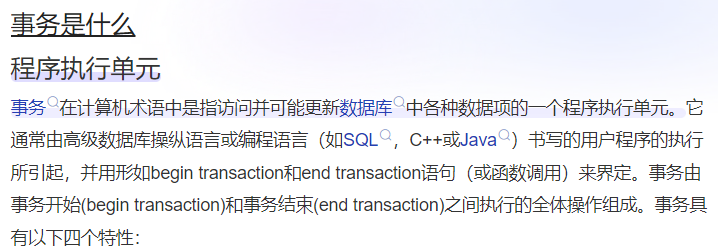

当我们学习 apple 时候，我们很容易记住 apple 是什么。

我们也不会对 apple 的概念产生模糊混淆。

为什么？

因为字典上明确说了，apple = 苹果。

那苹果是什么？

苹果就是圆圆的红红的，吃起来甜甜的水果。

我们学习 apple 如此简单，就是因为我们对苹果这个概念的理解已经通透到不能再通透。

那现在我们问，事务是什么？

我们百度一下。

在最开始，我死记硬背各种博客笔记对事务的定义。

好像理解了。

但是又没完全理解。

事务这个概念困扰了好久好久。

面试官问我事务，我好像也能对上几句。

但我真的像理解 apple 一样理解了事务吗？

没有。

为什么理解不了呢？

下面我们一点一点说。

---

我们为什么能理解 apple 像理解苹果一样简单？

因为我们从小就见过苹果。

当英文的 apple 翻译过来时，我们把对应脑海里的概念移植过去就可以很轻易的理解什么是 apple 。

事务和苹果区别就在这里。

“事务”二字是翻译过来的，翻译自“transaction”。

transaction 的出现是伴随计算机科学发展而来的产物。

也就是说，倒退200年，英文语境中的 transaction 并没有当前 transaction 作为计算机术语所包含的概念。

而那些计算机先人们需要一个词来表示这个计算机概念。

他们选择了 transaction 。

为什么选择 transaction ？

因为 transaction 主要含义为“交易，买卖”。

正好可以对应数据变化中“此消彼长、你变我也变”这种状态。

而当这一概念流转到中国，就需要一个对应的汉语词汇。

翻译家们选择了事务。

为什么选择“事务”我们不得而知。

猜测一下可能是“事务”相比于“交易”，使用频率更低，显得更正式，更难以理解，更能凸显其“舶来词”的特征。

为什么“事务”会更难以理解？

因为“事务”本身在汉语中有自己的意义。

**事务：指具体的事情、行政杂务、总务。**

这还不够。

最主要的让人混淆的地方在于：

“事务”的本地含义与它在计算机编程环境中所试图想要表达的含义大相径庭！

这也是我一年多都没有真正理解“事务”本质的原因。

那怎么样才能理解？

我们只需要把 transaction 在大脑中翻译“交易，转移“。

然后我们再来看“事务”的定义。

事务的英文是**transaction**，英文语境下的意思是**交易或者转移**，应用于金融和商业领域，设计货币、商品、服务等的互换。然后在计算机领域进行引申扩展，尤其在数据库管理和分布式系统中，含义为一系列操作作为一个整体被执行，要么全部成功，要么全部失败，以保证数据的完整性和一致性。

哇，终于舒服了，透气了！脑子里那团雾气终于散了！

---

所以，我们在这些分析中得到了什么？

1. 科技强国是硬道理。
2. 要学会透过现象看本质。
3. 语言只是沟通的工具，有效沟通的前提建立在双方认知在同一层面上。

---

所以让我们忘记狗屁事务，记住**transaction-交易**。

你要说为什么人家都用事务就你用交易？首先，我这不是交易，我这是transaction，其次，这个交易让我更好更直观的理解所谓“事务”的本质。当然了，为了与中文世界沟通顺畅，事务这个概念还是要使用，只是在脑子里要知道它的本质还是交易二字。**transaction-交易**具有4个基本特征：

- 原子性（Atomicity）：**交易**要么全部成功，要么全部不成功。
- 一致性（Consistency）：**交易**状态的最终改变必须满足我们的预期或规则。
- 隔离性（Isolation）：多个**交易**并发不会互相影响。
- 持久性（Durability）：**交易**提交成功，就是永久的。

在继续学习**transaction**之前，我们需要知道，研究transaction的意义在于解决某个或某类问题，所以我们先了解并总结一下人们到底遇到了什么问题。
# 并发访问导致的数据读取问题

1. 脏读
2. 可重复读
3. 幻读

在了解这三种问题之前再先看一张图，学一下英语。

1. Read uncommitted 读了未提交的数据
2. Read committed 和Read uncommitted正好相反
3. Repeatable read 可重复读
4. 串行化

然后聪明的我们从图中总结一下几点：

- 脏读的原因是Read uncommitted
- Read committed 解决了脏读的问题，但有不可重复读的问题
- Repeatable read解决不可重复读的问题
- Serializable提供最高隔离级别，解决所有并发访问问题
# 四种隔离级别
我们继续进一步分析，帮助理解记忆：

**脏读：**

脏读的原因是读取了未提交的数据**Read Uncommitted**，数据原本为n, A交易读取了B交易未提交的修改后后数据m, 但B报错回滚m又变回了n, A读到的却是m.这条m数据就是脏数据。

怎么解决脏读？

Read committed, 交易只能读取已经被其他交易提交的更改。

**不可重复读：**

我们解释一下unRepeatable read, 就是做不到Repeatable read，而Repeatable read的意思前后读取的数据一致，那什么情况会造成前后读取的不一致呢？

我们必须知道到了不可重复读这里，我们是已经解决了Read uncommitted，也就是现在是**Read committed**，我们的交易持续一上午，9点读一次余额，11点读一次余额，但中间还有个别的交易（取了2000块）在10点钟的时候2分钟做完了（committed），那我九点钟读余额还有2000，11点读就没钱了，这合理吗？这不合理。

这就是不可重复读。怎么解决？那当然就是变成可重复读就行了。

**Repeatable read**这个级别保证在整个交易期间可以多次读取同一数据并获得相同的结果，即使其他事务试图对这些数据进行修改。
这通过锁定读取的数据行来实现，防止其他交易修改它们。

下面说解决了不可重复读，还会产生幻读。

**幻读：**

幻读是发生在“我明明都已经是可重复读了”之后。

我8点的时候读数据一共100条，等到9点时候再读变成2w条了，就跟闹鬼了一样，这就是幻读，怎么解决？

锁表。所有交易一个个排队进行，谁也别干扰谁。（**Serializable**）

这样做的问题显而易见，太慢了。所以基本不用。

前边的交易主要针对**数据库数据管理的事务讲解**和**ACID中的隔离性的讲解**。

而实际开发中代码实现层面对于事务的控制，我们还有**Spring事务和分布式事务**。

以后有时间我们再说。

