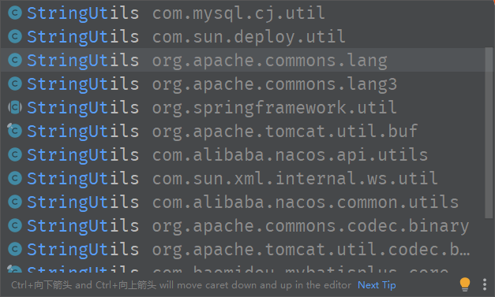

开发中经常遇到需要判空的地方，比如对字符串进行判空操作。

而有时候工具包太多不知道用哪个。

就像下图，光一个 StringUtils 就有十几个包弹出来。

怎么选？ 

 

其实用哪个都行。

最重要的是：

**有一套自己用的顺手的工具。**

或者换句话说：

**要养成自己的开发习惯。**

有了自己专属的开发习惯，不管客观上这个习惯是否是最优的，但一定要有一套，然后随着经验积累和实践，将这套习惯不断精进。

而且最重要的是：

**重要的甚至不是这套习惯，而是一种认知，一种行为方式。**


# 一、字符串

```powershell
<dependency>
    <groupId>org.apache.commons</groupId>
    <artifactId>commons-lang3</artifactId>
    <version>3.12.0</version> <!-- 替换为最新版本号 -->
</dependency>
```
```powershell
import org.apache.commons.lang3.StringUtils;

public class Main {
    public static void main(String[] args) {
        String myString = "Hello, World!";

        // 判断字符串是否为空
        if (StringUtils.isEmpty(myString)) {
            System.out.println("字符串为空");
        } else {
            System.out.println("字符串不为空");
        }

        // 判断字符串是否为空或只包含空格
        if (StringUtils.isBlank(myString)) {
            System.out.println("字符串为空或只包含空格");
        } else {
            System.out.println("字符串不为空且不只包含空格");
        }
    }
}

```
# 二、List

```java
import org.apache.commons.collections

// List判空
List<String> myList = new ArrayList<>();
if (CollectionUtils.isEmpty(myList)) {
    System.out.println("List为空");
} else {
    System.out.println("List不为空");
}
```
# 三、Map

```java
import org.apache.commons.collections.MapUtils

// Map判空
Map<String, Integer> myMap = new HashMap<>();
if (MapUtils.isEmpty(myMap)) {
    System.out.println("Map为空");
} else {
    System.out.println("Map不为空");
}
```
