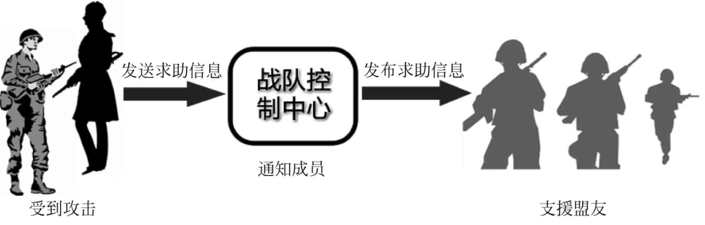

# 一、什么是观察者模式
**观察者模式**又叫做**发布-订阅模式**或者**源-监视器模式**。

结合它的各种别名大概就可以明白这种模式是做什么的。

其实就是观察与被观察，一个对象（被观察者）的状态改变会被通知到观察者，并根据通知产生各自的不同的行为。

以下为《设计模式的艺术》中给出的定义：

**观察者模式（Observer Pattern）：**定义对象之间的一种**一对多**依赖关系，使得每当一个对象**状态发生改变**时，其相关依赖对象皆**得到通知并被自动更新**。

# 二、观察者模式的4个角色
## Subject（目标）
Subject是被观察的对象。

Subject可以是接口、抽象类或者具体类。

它一般有**4个要素**：

- 一个观察者集合，一般用Vector。
- 增加观察者的方法。
- 删除观察者的方法。
- 通知方法notify（）。
## ConcreteSubject（具体目标）
是Subject的子类，没什么特殊的，如果有抽象方法需要实现就实现，没有的话这个类不写也行。
## Observer（观察者）
一般是个接口，声明一个update（）方法。
## ConcreteObserver（具体观察者）
刚开始学的话先会最简单的形式就可以了，就直接实现Observer接口，实现update（）方法就完了。


# 三、观察者模式2个代码实现案例
通过2个案例，基本就可以知道观察者模式是怎么回事了，对照观察者模式的4个角色，敲一遍。
## 单纯熟悉4个角色的案例
先写一个被观察者Subject
```java
public abstract class Subject {
    // 存放观察者的集合
    private Vector<Observer> obs = new Vector<>();

    public void addObserver(Observer obs) {
        this.obs.add(obs);
    }
    public void delObserver(Observer obs) {
        this.obs.remove(obs);
    }

    // 通知方法，写成抽象方法让ConcreteSubject实现也一样的
    protected void notifyObserver() {
        for (Observer ob : obs) {
            ob.update();
        }
    }
	// 这里也是可写可不写，根据业务需求
    public abstract void doSomething();

}
```

再写一个ConcreteSubject
```java
public class ConcreteSubject extends Subject {
    @Override
    public void doSomething() {
        System.out.println("被观察者事件发生改变");
        this.notifyObserver();
    }
}
```

观察者接口Observer
```java
public interface Observer {
    public void update();
}

```

观察者实现类ConcreteObserver，我们这里给出2个观察者
```java
public class ConcreteObserver01 implements Observer {
    @Override
    public void update() {
        System.out.println("观察者01收到状态变化信息，并进行处理...");
    }
}
```
```java
public class ConcreteObserver02 implements Observer {
    @Override
    public void update() {
        System.out.println("观察者02收到状态变化信息，并进行处理...");
    }
}
```

最后给出一个测试类，测试运行一个看看效果，看不明白代码就debug一下捋一捋。

以下代码的意思就是：

**你得有东西被观察被监视吧？**

所以先创建一个被观察者，比如我的账户余额。

**你得设置哪些对象在观察、监视我的账户吧？**

那就添加2个，我和我老婆。

然后就坐等账户余额有变化。

**一旦发工资，状态变化！！！**

**dosomething（）！**

**notifyObserver（）!**

**遍历观察者列表！**

**update（）！**

这个时候我和我老婆分别对应各自实现的update（）方法，我马上去买了游戏，我老婆马上去买了化妆品。

（不过这个例子好像不太合适，因为update方法里又会导致账户余额的变化，循环起来了，不过大概明白咋回事就行了。）

```java
public class Client {
    public static void main(String[] args) {
        ConcreteSubject subject = new ConcreteSubject();
        subject.addObserver(new ConcreteObserver01());
        subject.addObserver(new ConcreteObserver02());
        subject.doSomething();
    }
}
```
## 盟友受攻击发通知，其他盟友做出响应
这个例子也是《设计模式的艺术》给出的案例。

我们的需求如下：

联盟成员收到攻击→发送通知给盟友→盟友做出响应。

如果按照上述思路设计，则每个成员必须持有其他所有成员的状态信息，导致系统开销过大。所以我们引入一个**战队控制中心**来统一维护所有战队成员信息。



**依然是我们四步走：**

**先创建一个Subject被观察者，这里是AllyControlCenter控制中心**

```java
public abstract class AllyControlCenter {

    /**
     * 战队名称
     */
    protected String allyName;
    /**
     * 定义一个集合，用来存储具体观察者，也就是战队成员
     */
    protected Vector<Observer> players = new Vector<Observer>();

    /**
     * 加入战队
     */
    public void join(Observer observer) {
        System.out.println(observer.getName() + "加入" + this.allyName + "战队！");
        players.add(observer);
    }

    /**
     * 退出战队
     */
    public void quit(Observer observer) {
        System.out.println(observer.getName() + "退出" + this.allyName + "战队！");
        players.remove(observer);
    }

    /**
     * 声明抽象通知方法
     * @param name
     */
    public abstract void notifyObserver(String name);

    /**
     * 设置成员变量方法
     * @param allyName
     */
    public void setAllyName(String allyName) {
        this.allyName = allyName;
    }

    /**
     * 获取成员变量方法
     * @return
     */
    public String getAllyName() {
        return this.allyName;
    }
}
```
**再创建一个ConcreteSubject具体被观察者ConcreteAllyControlCenter**
```java
public class ConcreteAllayControlCenter extends AllyControlCenter {
    public ConcreteAllayControlCenter(String name) {
        System.out.println(name + "战队组建成功！");
        System.out.println("-------------");
        this.allyName = name;
    }

    /**
     * 实现通知方法
     * @param name
     */
    @Override
    public void notifyObserver(String name) {
        System.out.println(this.allyName + "战队紧急通知，盟友" + name + "遭受敌人攻击");
        // 遍历观察者集合，调用每一个盟友（除了自己）的支援方法
        for (Observer obs : players) {
            if (!obs.getName().equalsIgnoreCase(name)) {
                obs.help();
            }
        }
    }
}
```
**创建一个抽象观察者Observer**
```java
public interface Observer {
    public String getName();

    public void setName(String name);

    /**
     * 声明支援盟友的方法
     */
    public void help();

    /**
     * 声明遭受攻击的方法
     */
    public void beAttacked(AllyControlCenter acc);
}
```
**在创建具体观察者Player**
```java
public class Player implements Observer {
    private String name;

    public Player(String name) {
        this.name = name;
    }
    @Override
    public String getName() {
        return this.name;
    }

    @Override
    public void setName(String name) {
        this.name = name;
    }

    /**
     * 支援盟友的方法实现
     */
    @Override
    public void help() {
        System.out.println("坚持住，"+this.name +"来救你了！");
    }

    /**
     * 遭受攻击的方法实现
     * 当遭受攻击时，调用战队控制中心类的通知方法notifyObserver()来通知盟友
     * @param acc
     */
    @Override
    public void beAttacked(AllyControlCenter acc) {
        System.out.println(this.name + "被攻击！");
        acc.notifyObserver(name);
    }
}

```
**测试运行**
```java
public class Client {
    public static void main(String[] args) {
        // 定义被观察者
        AllyControlCenter acc = new ConcreteAllayControlCenter("金庸群侠");

        // 定义4个观察者
        Observer player1 = new Player("杨过");
        Observer player2 = new Player("令狐冲");
        Observer player3 = new Player("张无忌");
        Observer player4 = new Player("段誉");
        acc.join(player1);
        acc.join(player2);
        acc.join(player3);
        acc.join(player4);

        // 某成员遭受攻击
        player1.beAttacked(acc);

    }
}

```

# 四、我什么时候用观察者模式？

1. **事件处理系统**：例如，用户界面框架中，当用户进行某些操作（如点击按钮、移动鼠标等）时，可以使用观察者模式来通知相关的处理程序。
3. **数据订阅与发布系统**：在需要向多个客户端发布数据更新的场景中，例如股票行情显示、新闻更新等，可以使用观察者模式。
4. **跨系统的消息交换**：例如，在微服务架构中，服务间的事件可以通过观察者模式进行通信，确保各服务间的解耦。
5. **状态监控和警报系统**：在需要监控某些状态并在特定条件下发送警报的系统中，观察者模式可以用来实现监控对象和警报系统之间的通信。
6. **配置管理**：当系统配置信息发生变更时，使用观察者模式可以实时通知各个使用配置的组件进行相应的调整。
