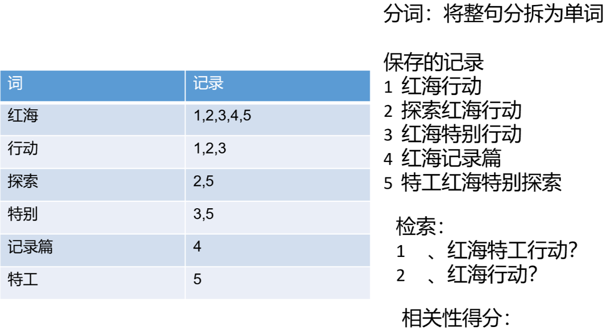
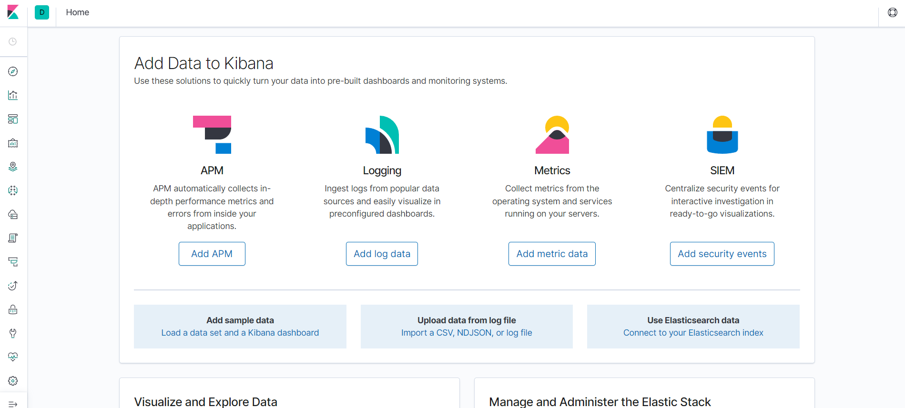
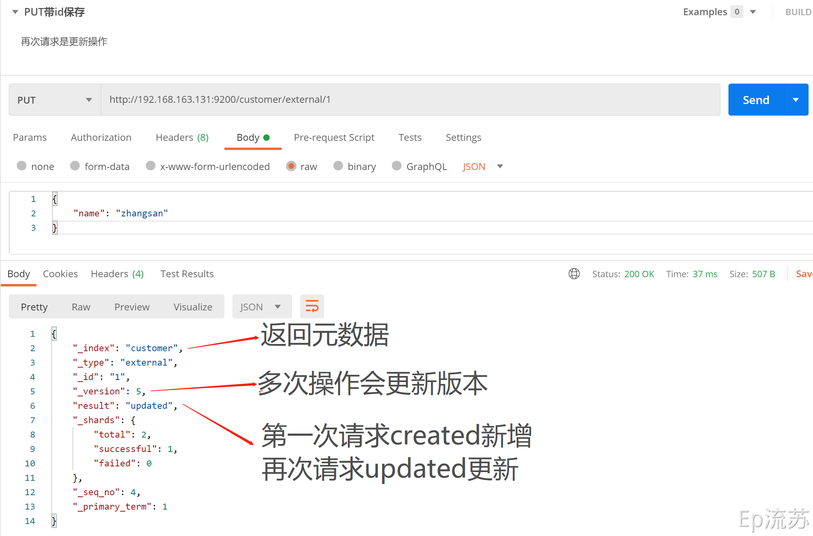
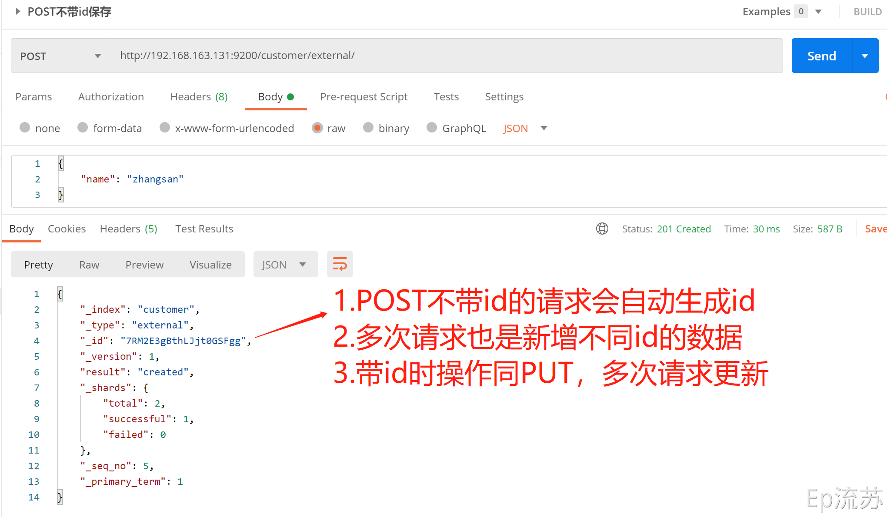
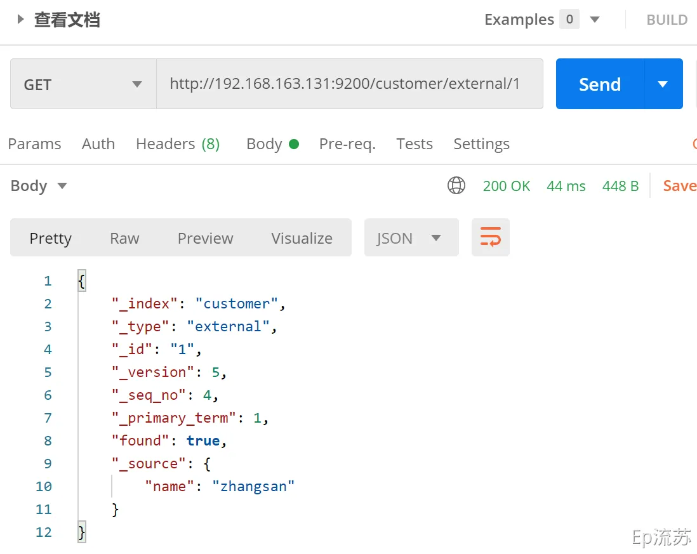
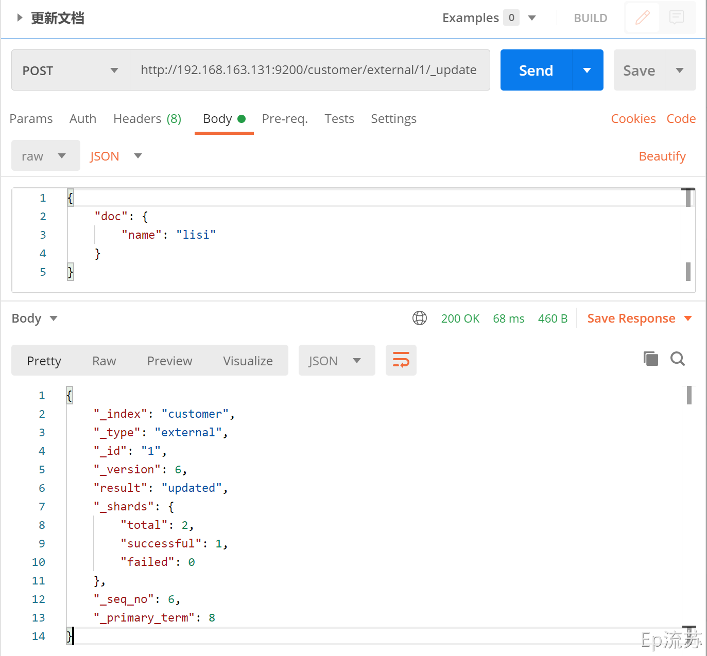
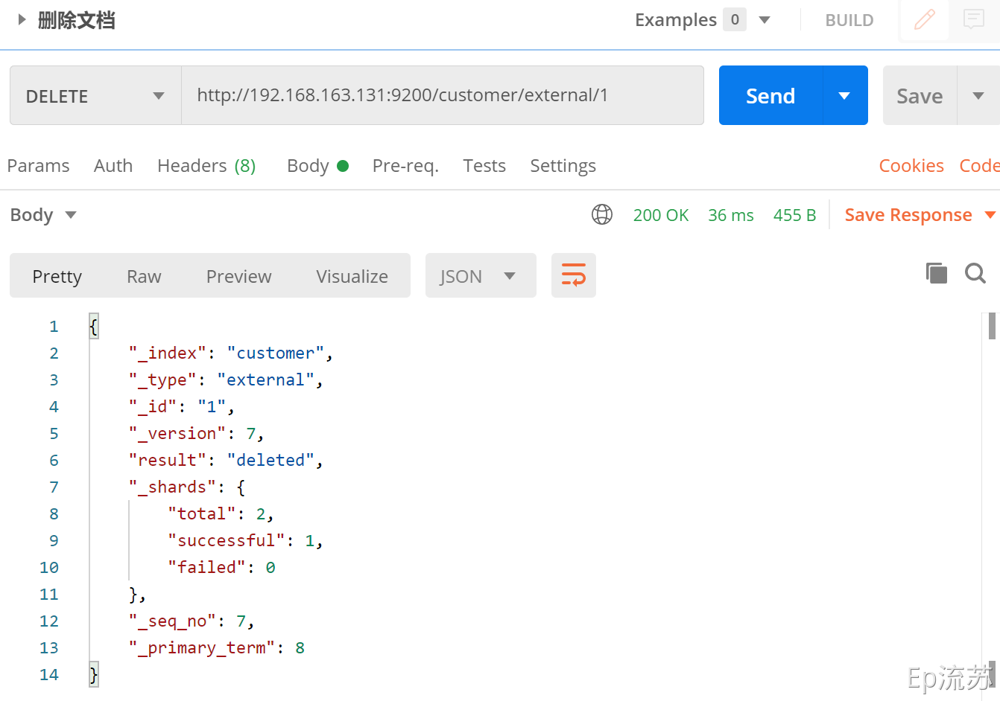
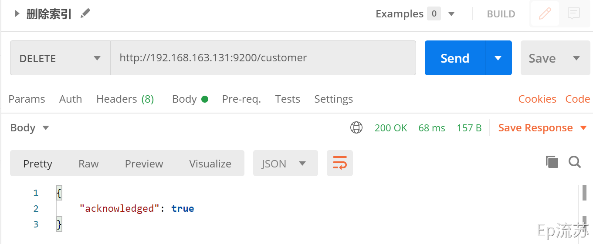
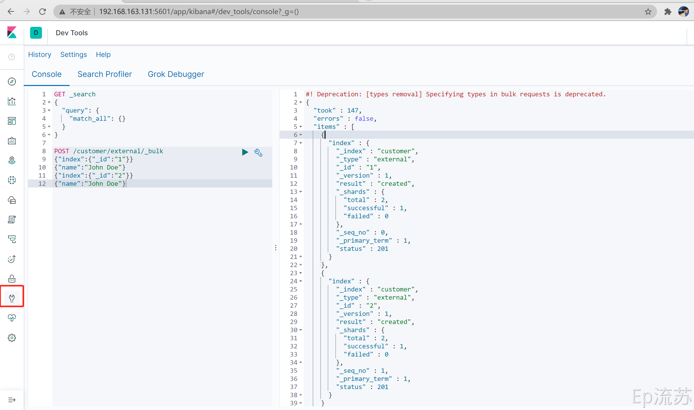
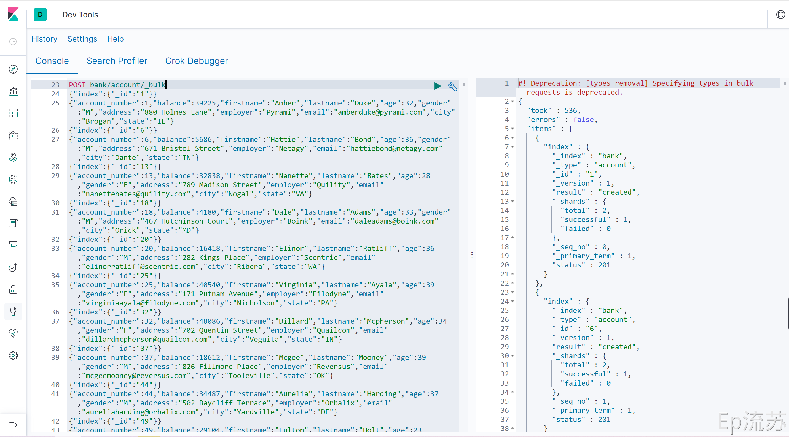

# 一、介绍及安装

## 1.索引、类型、文档

## 2.倒排索引

​	 

## 3.Docker安装Elasticsearch、Kibana

### 3.1下载镜像文件

```shell
# 存储和检索数据
docker pull elasticsearch:7.4.2

# 可视化检索数据
docker pull kibana:7.4.2
```

### 3.2 配置挂载数据文件夹

```shell
# 创建配置文件目录
mkdir -p /mydata/elasticsearch/config

# 创建数据目录
mkdir -p /mydata/elasticsearch/data

# 将/mydata/elasticsearch/文件夹中文件都可读可写
chmod -R 777 /mydata/elasticsearch/

# 配置任意机器可以访问 elasticsearch
echo "http.host: 0.0.0.0" >/mydata/elasticsearch/config/elasticsearch.yml
```

### 3.3启动Elasticsearch

命令后面的 \是换行符，注意前面有空格

```shell
docker run --name elasticsearch -p 9200:9200 -p 9300:9300 \
-e  "discovery.type=single-node" \
-e ES_JAVA_OPTS="-Xms64m -Xmx512m" \
-v /mydata/elasticsearch/config/elasticsearch.yml:/usr/share/elasticsearch/config/elasticsearch.yml \
-v /mydata/elasticsearch/data:/usr/share/elasticsearch/data \
-v  /mydata/elasticsearch/plugins:/usr/share/elasticsearch/plugins \
-d elasticsearch:7.4.2
```

- `-p 9200:9200 -p 9300:9300`：向外暴露两个端口，9200用于HTTP REST API请求，9300 ES 在分布式集群状态下 ES 之间的通信端口；
- `-e  "discovery.type=single-node"`：es 以单节点运行
- `-e ES_JAVA_OPTS="-Xms64m -Xmx512m"`：设置启动占用内存，不设置可能会占用当前系统所有内存
- -v：挂载容器中的配置文件、数据文件、插件数据到本机的文件夹；
- `-d elasticsearch:7.4.2`：指定要启动的镜像

访问 IP:9200 看到返回的 json 数据说明启动成功。

 

### 3.4设置 Elasticsearch 随Docker启动

```shell
# 当前 Docker 开机自启，所以 ES 现在也是开机自启
docker update elasticsearch --restart=always
```

### 3.5启动可视化Kibana

```shell
docker run --name kibana \
-e ELASTICSEARCH_HOSTS=http://ip:9200 \
-p 5601:5601 \
-d kibana:7.4.2

docker run --name kibana \
-e ELASTICSEARCH_HOSTS=http://43.143.198.2:9200 \
-p 5601:5601 \
-d kibana:7.4.2
```

**浏览器输入**192.168.163.131:5601 测试。

 

### 3.6设置 Kibana 随Docker启动

```shell
# 当前 Docker 开机自启，所以 kibana 现在也是开机自启
docker update kibana --restart=always
```

# 二、使用入门

前面介绍说，Elasticsearch 都是通过 REST API 接口来操作数据的，那么下面接通过几个接口的请求来演示它的使用。

1. /_cat/nodes：查看所有节点

2. /_cat/health：查看ES健康状况

3. /_cat/master：查看主节点信息

4. /_cat/indicies：查看所有索引	

## 创建一个索引

接口：`PUT /{{index_name}}`

PUT 接口具有幂等性，多次请求不会重复创建，且只支持 PUT 请求。


## 索引一个文档

即保存一条数据，保存在哪个索引的哪个类型下，指定用哪个唯一标识。

### 1. PUT 请求

接口：`PUT http://192.168.163.131:9200/customer/external/1`



### 2. POST 请求

接口：`POST http://192.168.163.131:9200/customer/external/`



PUT和POST都可以

- POST新增，如果不指定id，会自动生成id。指定id就会修改这个数据，并新增版本号；
- PUT可以新增也可以修改。PUT必须指定id；由于PUT需要指定id，我们一般用来做修改操作，不指定id会报错。


 

## 查看文档

### /index/type/id

 

接口：`GET http://192.168.163.131:9200/customer/external/1`



```json
{
    "_index": "customer",  # 在哪个索引(库)
    "_type": "external",   # 在哪个类型(表)
    "_id": "1",			   # 文档id(记录)
    "_version": 5,		   # 版本号
    "_seq_no": 4,		   # 并发控制字段，每次更新都会+1，用来做乐观锁
    "_primary_term": 1,	   # 同上，主分片重新分配，如重启，就会变化
    "found": true,
    "_source": {		   # 数据
        "name": "zhangsan"
    }
}

# 乐观锁更新时携带 ?_seq_no=0&_primary_term=1  当携带数据与实际值不匹配时更新失败
```

## 更新文档

### /index/type/id/_update

接口：`POST http://192.168.163.131:9200/customer/external/1/_update`



### 几种更新文档的区别

在上面索引文档即保存文档的时候介绍，还有两种更新文档的方式：

- 当PUT请求带id，且有该id数据存在时，会更新文档；
- 当POST请求带id，与PUT相同，该id数据已经存在时，会更新文档；

这两种请求类似，即带id，且数据存在，就会执行更新操作。

类比：

- 请求体的报文格式不同，_update方式要修改的数据要包裹在 doc 键下
- _update方式不会重复更新，数据已存在不会更新，版本号不会改变，另两种方式会重复更新（覆盖原来数据），版本号会改变
- 这几种方式在更新时都可以增加属性，PUT请求带id更新和POST请求带id更新，会直接覆盖原来的数据，不会在原来的属性里面新增属性，POST带id/_update更新，不会覆盖原来的数据，可以向原来的数据中新增属性

## 删除文档&索引

### 删除文档

接口：`DELETE http://192.168.163.131:9200/customer/external/1`



### 删除索引

接口：`DELETE http://192.168.163.131:9200/customer`




## bulk-批量操作数据

语法格式：

```json
{action:{metadata}}\n   // 例如index保存记录，update更新
{request body  }\n

{action:{metadata}}\n
{request body  }\n
```

### 1. 指定索引和类型的批量操作

接口：`POST /customer/external/_bulk`

参数：

```json
{"index":{"_id":"1"}}
{"name":"John Doe"}
{"index":{"_id":"2"}}
{"name":"John Doe"}
```

在Kibana中使用dev-tools测试批量：



### 2. 对所有索引执行批量操作

接口：`POST /_bulk`

参数：

```json
{"delete":{"_index":"website","_type":"blog","_id":"123"}}

{"create":{"_index":"website","_type":"blog","_id":"123"}}
{"title":"my first blog post"}

{"index":{"_index":"website","_type":"blog"}}
{"title":"my second blog post"}
	
{"update":{"_index":"website","_type":"blog","_id":"123"}}
{"doc":{"title":"my updated blog post"}}
```

- 这里的批量操作，当发生某一条执行发生失败时，其他的数据仍然能够接着执行，也就是说彼此之间是独立的。
- bulk api以此按顺序执行所有的action（动作）。如果一个单个的动作因任何原因失败，它将继续处理它后面剩余的动作。
- 当bulk api返回时，它将提供每个动作的状态（与发送的顺序相同），所以您可以检查是否一个指定的动作是否失败了。


# 三、Elasticsearch-检索进阶

本节参考 [官方文档](https://www.elastic.co/guide/en/elasticsearch/reference/current/getting-started-search.html) 检索示例：

## 导入样本测试数据

准备一份顾客银行账户信息的虚构的JSON文档样本。每个文档都有下列的 schema（模式）。

```json
{
    "account_number": 1,
    "balance": 39225,
    "firstname": "Amber",
    "lastname": "Duke",
    "age": 32,
    "gender": "M",
    "address": "880 Holmes Lane",
    "employer": "Pyrami",
    "email": "amberduke@pyrami.com",
    "city": "Brogan",
    "state": "IL"
}
```

https://raw.githubusercontent.com/elastic/elasticsearch/7.4/docs/src/test/resources/accounts.json

导入测试数据：

`POST bank/account/_bulk`



# 

## 检索示例介绍

下面的请求都是在Kibana dev-tools 操作

### 请求接口

```json
GET /bank/_search
{
  "query": {
    "match_all": {}
  },
  "sort": [
    {
      "account_number": "asc"
    }
  ]
}
# query 查询条件
# sort 排序条件
```

### 结果

```json
{
  "took" : 7,
  "timed_out" : false,
  "_shards" : {
    "total" : 1,
    "successful" : 1,
    "skipped" : 0,
    "failed" : 0
  },
  "hits" : {
    "total" : {
      "value" : 1000,
      "relation" : "eq"
    },
    "max_score" : null,
    "hits" : [
      {
        "_index" : "bank",
        "_type" : "account",
        "_id" : "0",
        "_score" : null,
        "_source" : {
          "account_number" : 0,
          "balance" : 16623,
          "firstname" : "Bradshaw",
          "lastname" : "Mckenzie",
          "age" : 29,
          "gender" : "F",
          "address" : "244 Columbus Place",
          "employer" : "Euron",
          "email" : "bradshawmckenzie@euron.com",
          "city" : "Hobucken",
          "state" : "CO"
        },
        "sort" : [
          0
        ]
      },
      ...
    ]
  }
}
```

### 响应字段解释

- `took` – how long it took Elasticsearch to run the query, in milliseconds
- `timed_out` – whether or not the search request timed out
- `_shards` – how many shards were searched and a breakdown of how many shards succeeded, failed, or were skipped.
- `max_score` – the score of the most relevant document found
- `hits.total.value` - how many matching documents were found
- `hits.sort` - the document’s sort position (when not sorting by relevance score)
- `hits._score` - the document’s relevance score (not applicable when using `match_all`)

### 响应结果说明

Elasticsearch 默认会分页返回10条数据，不会一下返回所有数据。

### 请求方式说明

ES支持两种基本方式检索；

- 通过REST request uri 发送搜索参数 （uri +检索参数）；
- 通过REST request body 来发送它们（uri+请求体）；


也就是说除了上面示例的请求接口，根据请求体进行检索外；

还可以用GET请求参数的方式检索：

```json
GET bank/_search?q=*&sort=account_number:asc
# q=* 查询所有
# sort=account_number:asc 按照account_number进行升序排列
```

## Query DSL

本小节参考官方文档：[Query DSL](https://www.elastic.co/guide/en/elasticsearch/reference/current/query-dsl.html)

Elasticsearch提供了一个可以执行查询的Json风格的DSL。这个被称为Query DSL，该查询语言非常全面。

### 1. 基本语法格式

一个查询语句的典型结构:

```json
QUERY_NAME:{
   ARGUMENT:VALUE,
   ARGUMENT:VALUE,...
}
```

如果针对于某个字段，那么它的结构如下：

```json
{
  QUERY_NAME:{
     FIELD_NAME:{
       ARGUMENT:VALUE,
       ARGUMENT:VALUE,...
      }   
   }
}
```

请求示例：

```json
GET bank/_search
{
  "query": {
    "match_all": {}
  },
  "from": 0,
  "size": 5,
  "sort": [
    {
      "account_number": {
        "order": "desc"
      },
      "balance": {
      	"order": "asc"
      }
    }
  ]
}

# match_all 查询类型【代表查询所有的所有】，es中可以在query中组合非常多的查询类型完成复杂查询；
# from+size 限定，完成分页功能；从第几条数据开始，每页有多少数据
# sort 排序，多字段排序，会在前序字段相等时后续字段内部排序，否则以前序为准；
```

### 2. 返回部分字段

请求示例：

```json
GET bank/_search
{
  "query": {
    "match_all": {}
  },
  "from": 0,
  "size": 5,
  "sort": [
    {
      "account_number": {
        "order": "desc"
      }
    }
  ],
  "_source": ["balance","firstname"]
}

# _source 指定返回结果中包含的字段名
```

结果示例：

```json
{
  "took" : 2,
  "timed_out" : false,
  "_shards" : {
    "total" : 1,
    "successful" : 1,
    "skipped" : 0,
    "failed" : 0
  },
  "hits" : {
    "total" : {
      "value" : 1000,
      "relation" : "eq"
    },
    "max_score" : null,
    "hits" : [
      {
        "_index" : "bank",
        "_type" : "account",
        "_id" : "999",
        "_score" : null,
        "_source" : {
          "firstname" : "Dorothy",
          "balance" : 6087
        },
        "sort" : [
          999
        ]
      },
    	...
    ]
 	}
}
```

### 3. match-匹配查询

#### 精确查询-基本数据类型(非文本)

```json
GET bank/_search
{
  "query": {
    "match": {
      "account_number": 20
    }
  }
}
# 查找匹配 account_number 为 20 的数据 非文本推荐使用 term
```

#### 模糊查询-文本字符串

```json
GET bank/_search
{
  "query": {
    "match": {
      "address": "mill lane"
    }
  }
}
# 查找匹配 address 包含 mill 或 lane 的数据
```

match即全文检索，对检索字段进行分词匹配，会按照响应的评分 _score 排序，原理是倒排索引。

#### 精确匹配-文本字符串

```json
GET bank/_search
{
  "query": {
    "match": {
      "address.keyword": "288 Mill Street"
    }
  }
}
# 查找 address 为 288 Mill Street 的数据。
# 这里的查找是精确查找，只有完全匹配时才会查找出存在的记录，
# 如果想模糊查询应该使用match_phrase 短语匹配
```

### 4. match_phrase-短语匹配

将需要匹配的值当成一整个单词（不分词）进行检索

```json
GET bank/_search
{
  "query": {
    "match_phrase": {
      "address": "mill lane"
    }
  }
}
# 这里会检索 address 匹配包含短语 mill lane 的数据
```

### 5. multi_math-多字段匹配

```json
GET bank/_search
{
  "query": {
    "multi_match": {
      "query": "mill",
      "fields": [
        "city",
        "address"
      ]
    }
  }
}
# 检索 city 或 address 匹配包含 mill 的数据，会对查询条件分词
```

### 6. bool-复合查询

复合语句可以合并，任何其他查询语句，包括复合语句。这也就意味着，复合语句之间可以互相嵌套，可以表达非常复杂的逻辑。

- must：必须达到must所列举的所有条件
- must_not，必须不匹配must_not所列举的所有条件。
- should，应该满足should所列举的条件。

```json
GET bank/_search
{
  "query": {
    "bool": {
      "must": [
        {
          "match": {
            "gender": "M"
          }
        },
        {
          "match": {
            "address": "mill"
          }
        }
      ]
    }
  }
}
# 查询 gender 为 M 且 address 包含 mill 的数据
```

### 7. filter-结果过滤

并不是所有的查询都需要产生分数，特别是哪些仅用于filtering过滤的文档。为了不计算分数，elasticsearch会自动检查场景并且优化查询的执行。

filter 对结果进行过滤，且不计算相关性得分。

```json
GET bank/_search
{
  "query": {
    "bool": {
      "must": [
        {
          "match": {
            "address": "mill"
          }
        }
      ],
      "filter": {
        "range": {
          "balance": {
            "gte": "10000",
            "lte": "20000"
          }
        }
      }
    }
  }
}
# 这里先是查询所有匹配 address 包含 mill 的文档，
# 然后再根据 10000<=balance<=20000 进行过滤查询结果
```

> Each `must`, `should`, and `must_not` element in a Boolean query is referred to as a query clause. How well a document meets the criteria in each `must` or `should` clause contributes to the document’s *relevance score*. The higher the score, the better the document matches your search criteria. By default, Elasticsearch returns documents ranked by these relevance scores.
>
>  在boolean查询中，`must`, `should` 和`must_not` 元素都被称为查询子句 。 文档是否符合每个“must”或“should”子句中的标准，决定了文档的“相关性得分”。  得分越高，文档越符合您的搜索条件。  默认情况下，Elasticsearch 返回根据这些相关性得分排序的文档。 
>
> 
>
> The criteria in a `must_not` clause is treated as a *filter*. It affects whether or not the document is included in the results, but does not contribute to how documents are scored. You can also explicitly specify arbitrary filters to include or exclude documents based on structured data.
>
> `“must_not”子句中的条件被视为“过滤器”。` 它影响文档是否包含在结果中，但**不影响文档的评分方式**。还可以显式地指定任意过滤器来包含或排除基于结构化数据的文档。 

### 8. term-精确检索

> Avoid using the `term` query for `text` fields.
>
> 避免使用 term 查询文本字段
>
> By default, Elasticsearch changes the values of `text` fields as part of [analysis](https://www.elastic.co/guide/en/elasticsearch/reference/7.11/analysis.html). This can make finding exact matches for `text` field values difficult.
>
> 默认情况下，Elasticsearch 会通过[analysis](https://www.elastic.co/guide/en/elasticsearch/reference/7.11/analysis.html)分词将文本字段的值拆分为一部分，这使精确匹配文本字段的值变得困难。
>
> To search `text` field values, use the `match` query instead.
>
> 如果要查询文本字段值，请使用 match 查询代替。
>
> 
>
> https://www.elastic.co/guide/en/elasticsearch/reference/7.11/query-dsl-term-query.html

```json
GET bank/_search
{
  "query": {
    "term": {
      "age": "28"
    }
  }
}
# 查找 age 为 28 的数据
```

### 9. Aggregation-执行聚合

https://www.elastic.co/guide/en/elasticsearch/reference/7.11/search-aggregations.html

#### 聚合语法

```json
GET /my-index-000001/_search
{
  "aggs":{
    "aggs_name":{    # 这次聚合的名字，方便展示在结果集中
        "AGG_TYPE":{ # 聚合的类型(avg,term,terms)
        }	
     }
	}
}
```

#### 示例1-搜索address中包含mill的所有人的年龄分布以及平均年龄

```json
GET bank/_search
{
  "query": {
    "match": {
      "address": "Mill"
    }
  },
  "aggs": {
    "ageAgg": {
      "terms": {
        "field": "age",
        "size": 10
      }
    },
    "ageAvg": {
      "avg": {
        "field": "age"
      }
    },
    "balanceAvg": {
      "avg": {
        "field": "balance"
      }
    }
  },
  "size": 0
}
# "ageAgg": {   				  --- 聚合名为 ageAgg
#   "terms": {				    --- 聚合类型为 term
#     "field": "age",     --- 聚合字段为 age
#     "size": 10			    --- 取聚合后前十个数据
#   }
# },
# ------------------------
# "ageAvg": {   				  --- 聚合名为 ageAvg
#   "avg": {				      --- 聚合类型为 avg 求平均值
#     "field": "age"	    --- 聚合字段为 age
#   }
# },
# ------------------------
# "balanceAvg": {				  --- 聚合名为 balanceAvg
#   "avg": {				      --- 聚合类型为 avg 求平均值
#     "field": "balance"  --- 聚合字段为 balance
#   }
# }
# ------------------------
# "size": 0               --- 不显示命中结果，只看聚合信息
```

结果：

```json
{
  "took" : 10,
  "timed_out" : false,
  "_shards" : {
    "total" : 1,
    "successful" : 1,
    "skipped" : 0,
    "failed" : 0
  },
  "hits" : {
    "total" : {
      "value" : 4,
      "relation" : "eq"
    },
    "max_score" : null,
    "hits" : [ ]
  },
  "aggregations" : {
    "ageAgg" : {
      "doc_count_error_upper_bound" : 0,
      "sum_other_doc_count" : 0,
      "buckets" : [
        {
          "key" : 38,
          "doc_count" : 2
        },
        {
          "key" : 28,
          "doc_count" : 1
        },
        {
          "key" : 32,
          "doc_count" : 1
        }
      ]
    },
    "ageAvg" : {
      "value" : 34.0
    },
    "balanceAvg" : {
      "value" : 25208.0
    }
  }
}
```

#### 示例2-按照年龄聚合，并且求这些年龄段的这些人的平均薪资

```json
GET bank/_search
{
  "query": {
    "match_all": {}
  },
  "aggs": {
    "ageAgg": {
      "terms": {
        "field": "age",
        "size": 100
      },
      "aggs": {
        "ageAvg": {
          "avg": {
            "field": "balance"
          }
        }
      }
    }
  },
  "size": 0
}
```

结果：

```json
{
  "took" : 12,
  "timed_out" : false,
  "_shards" : {
    "total" : 1,
    "successful" : 1,
    "skipped" : 0,
    "failed" : 0
  },
  "hits" : {
    "total" : {
      "value" : 1000,
      "relation" : "eq"
    },
    "max_score" : null,
    "hits" : [ ]
  },
  "aggregations" : {
    "ageAgg" : {
      "doc_count_error_upper_bound" : 0,
      "sum_other_doc_count" : 0,
      "buckets" : [
        {
          "key" : 31,
          "doc_count" : 61,
          "ageAvg" : {
            "value" : 28312.918032786885
          }
        },
        {
          "key" : 39,
          "doc_count" : 60,
          "ageAvg" : {
            "value" : 25269.583333333332
          }
        },
        {
          "key" : 26,
          "doc_count" : 59,
          "ageAvg" : {
            "value" : 23194.813559322032
          }
        },
        {
          "key" : 32,
          "doc_count" : 52,
          "ageAvg" : {
            "value" : 23951.346153846152
          }
        },
        {
          "key" : 35,
          "doc_count" : 52,
          "ageAvg" : {
            "value" : 22136.69230769231
          }
        },
        {
          "key" : 36,
          "doc_count" : 52,
          "ageAvg" : {
            "value" : 22174.71153846154
          }
        },
        {
          "key" : 22,
          "doc_count" : 51,
          "ageAvg" : {
            "value" : 24731.07843137255
          }
        },
        {
          "key" : 28,
          "doc_count" : 51,
          "ageAvg" : {
            "value" : 28273.882352941175
          }
        },
        {
          "key" : 33,
          "doc_count" : 50,
          "ageAvg" : {
            "value" : 25093.94
          }
        },
        {
          "key" : 34,
          "doc_count" : 49,
          "ageAvg" : {
            "value" : 26809.95918367347
          }
        },
        {
          "key" : 30,
          "doc_count" : 47,
          "ageAvg" : {
            "value" : 22841.106382978724
          }
        },
        {
          "key" : 21,
          "doc_count" : 46,
          "ageAvg" : {
            "value" : 26981.434782608696
          }
        },
        {
          "key" : 40,
          "doc_count" : 45,
          "ageAvg" : {
            "value" : 27183.17777777778
          }
        },
        {
          "key" : 20,
          "doc_count" : 44,
          "ageAvg" : {
            "value" : 27741.227272727272
          }
        },
        {
          "key" : 23,
          "doc_count" : 42,
          "ageAvg" : {
            "value" : 27314.214285714286
          }
        },
        {
          "key" : 24,
          "doc_count" : 42,
          "ageAvg" : {
            "value" : 28519.04761904762
          }
        },
        {
          "key" : 25,
          "doc_count" : 42,
          "ageAvg" : {
            "value" : 27445.214285714286
          }
        },
        {
          "key" : 37,
          "doc_count" : 42,
          "ageAvg" : {
            "value" : 27022.261904761905
          }
        },
        {
          "key" : 27,
          "doc_count" : 39,
          "ageAvg" : {
            "value" : 21471.871794871793
          }
        },
        {
          "key" : 38,
          "doc_count" : 39,
          "ageAvg" : {
            "value" : 26187.17948717949
          }
        },
        {
          "key" : 29,
          "doc_count" : 35,
          "ageAvg" : {
            "value" : 29483.14285714286
          }
        }
      ]
    }
  }
}
```

#### 示例3-查出所有年龄分布，并且这些年龄段中M的平均薪资和F的平均薪资以及这个年龄段的总体平均薪资

```json
GET bank/_search
{
  "query": {
    "match_all": {}
  },
  "aggs": {
    "ageAgg": {
      "terms": {
        "field": "age",
        "size": 100
      },
      "aggs": {
        "genderAgg": {
          "terms": {
            "field": "gender.keyword"
          },
          "aggs": {
            "balanceAvg": {
              "avg": {
                "field": "balance"
              }
            }
          }
        },
        "ageBalanceAvg": {
          "avg": {
            "field": "balance"
          }
        }
      }
    }
  },
  "size": 0
}
# "field": "gender.keyword" gender是txt没法聚合 必须加.keyword精确替代
```

结果：

```json
{
  "took" : 17,
  "timed_out" : false,
  "_shards" : {
    "total" : 1,
    "successful" : 1,
    "skipped" : 0,
    "failed" : 0
  },
  "hits" : {
    "total" : {
      "value" : 1000,
      "relation" : "eq"
    },
    "max_score" : null,
    "hits" : [ ]
  },
  "aggregations" : {
    "ageAgg" : {
      "doc_count_error_upper_bound" : 0,
      "sum_other_doc_count" : 0,
      "buckets" : [
        {
          "key" : 31,
          "doc_count" : 61,
          "genderAgg" : {
            "doc_count_error_upper_bound" : 0,
            "sum_other_doc_count" : 0,
            "buckets" : [
              {
                "key" : "M",
                "doc_count" : 35,
                "balanceAvg" : {
                  "value" : 29565.628571428573
                }
              },
              {
                "key" : "F",
                "doc_count" : 26,
                "balanceAvg" : {
                  "value" : 26626.576923076922
                }
              }
            ]
          },
          "ageBalanceAvg" : {
            "value" : 28312.918032786885
          }
        },
        {
          "key" : 39,
          "doc_count" : 60,
          "genderAgg" : {
            "doc_count_error_upper_bound" : 0,
            "sum_other_doc_count" : 0,
            "buckets" : [
              {
                "key" : "F",
                "doc_count" : 38,
                "balanceAvg" : {
                  "value" : 26348.684210526317
                }
              },
              {
                "key" : "M",
                "doc_count" : 22,
                "balanceAvg" : {
                  "value" : 23405.68181818182
                }
              }
            ]
          },
          "ageBalanceAvg" : {
            "value" : 25269.583333333332
          }
        },
        ...
      ]
    }
  }
}
```


# 四、Mapping映射

https://www.elastic.co/guide/en/elasticsearch/reference/7.11/mapping.html

## 1. Mapping介绍

Maping是用来定义一个文档（document），以及它所包含的属性（field）是如何存储和索引的。

比如：使用maping来定义：

- 哪些字符串属性应该被看做全文本属性（full text fields）；
- 哪些属性包含数字，日期或地理位置；
- 文档中的所有属性是否都能被索引（all 配置）；
- 日期的格式；
- 自定义映射规则来执行动态添加属性；

查看mapping信息

```json
GET bank/_mapping

{
  "bank" : {
    "mappings" : {
      "properties" : {
        "account_number" : {
          "type" : "long"
        },
        "address" : {
          "type" : "text",
          "fields" : {
            "keyword" : {
              "type" : "keyword",
              "ignore_above" : 256
            }
          }
        },
        "age" : {
          "type" : "long"
        },
        "balance" : {
          "type" : "long"
        },
        "city" : {
          "type" : "text",
          "fields" : {
            "keyword" : {
              "type" : "keyword",
              "ignore_above" : 256
            }
          }
        },
        "email" : {
          "type" : "text",
          "fields" : {
            "keyword" : {
              "type" : "keyword",
              "ignore_above" : 256
            }
          }
        },
        "employer" : {
          "type" : "text",
          "fields" : {
            "keyword" : {
              "type" : "keyword",
              "ignore_above" : 256
            }
          }
        },
        "firstname" : {
          "type" : "text",
          "fields" : {
            "keyword" : {
              "type" : "keyword",
              "ignore_above" : 256
            }
          }
        },
        "gender" : {
          "type" : "text",
          "fields" : {
            "keyword" : {
              "type" : "keyword",
              "ignore_above" : 256
            }
          }
        },
        "lastname" : {
          "type" : "text",
          "fields" : {
            "keyword" : {
              "type" : "keyword",
              "ignore_above" : 256
            }
          }
        },
        "state" : {
          "type" : "text",
          "fields" : {
            "keyword" : {
              "type" : "keyword",
              "ignore_above" : 256
            }
          }
        }
      }
    }
  }
}
```

## 2. 新版本type移除

ElasticSearch7-去掉type概念

1. 关系型数据库中两个数据表示是独立的，即使他们里面有相同名称的列也不影响使用，但ES中不是这样的。elasticsearch是基于Lucene开发的搜索引擎，而ES中不同type下名称相同的filed最终在Lucene中的处理方式是一样的。

- - 两个不同type下的两个user_name，在ES同一个索引下其实被认为是同一个filed，你必须在两个不同的type中定义相同的filed映射。否则，不同type中的相同字段名称就会在处理中出现冲突的情况，导致Lucene处理效率下降。
  - 去掉type就是为了提高ES处理数据的效率。

1. Elasticsearch 7.x URL中的type参数为可选。比如，索引一个文档不再要求提供文档类型。
2. Elasticsearch 8.x 不再支持URL中的type参数。
3. 解决：
   将索引从多类型迁移到单类型，每种类型文档一个独立索引
   将已存在的索引下的类型数据，全部迁移到指定位置即可。详见数据迁移

## 3. 属性类型

参考：官方[属性类型](https://www.elastic.co/guide/en/elasticsearch/reference/7.x/mapping-types.html)


## 4. 映射操作

参考：创建[映射操作](https://www.elastic.co/guide/en/elasticsearch/reference/7.x/explicit-mapping.html)

### 4.1 创建索引映射

创建索引并指定属性的映射规则（相当于新建表并指定字段和字段类型）

```json
PUT /my_index
{
  "mappings": {
    "properties": {
      "age": {
        "type": "integer"
      },
      "email": {
        "type": "keyword"
      },
      "name": {
        "type": "text"
      }
    }
  }
}
```

结果：

```json
{
  "acknowledged" : true,
  "shards_acknowledged" : true,
  "index" : "my_index"
}
```

### 4.2 给已有映射增加字段

https://www.elastic.co/guide/en/elasticsearch/reference/7.x/explicit-mapping.html#add-field-mapping

```json
PUT /my_index/_mapping
{
  "properties": {
    "employee-id": {
      "type": "keyword",
      "index": false
    }
  }
}

# 这里的 "index": false，表明新增的字段不能被检索。默认是true
# https://www.elastic.co/guide/en/elasticsearch/reference/7.x/mapping-index.html
```

结果：

```json
{
  "acknowledged" : true
}
```

### 4.3 查看映射

https://www.elastic.co/guide/en/elasticsearch/reference/7.x/explicit-mapping.html#view-mapping

```json
GET /my_index/_mapping
# 查看某一个字段的映射
GET /my_index/_mapping/field/employee-id
```

结果：

```json
{
  "my_index" : {
    "mappings" : {
      "properties" : {
        "age" : {
          "type" : "integer"
        },
        "email" : {
          "type" : "keyword"
        },
        "employee-id" : {
          "type" : "keyword",
          "index" : false
        },
        "name" : {
          "type" : "text"
        }
      }
    }
  }
}
# index false 表示不能被索引找到
```

### 4.4 更新映射

https://www.elastic.co/guide/en/elasticsearch/reference/7.x/explicit-mapping.html#update-mapping

对于已经存在的字段映射，我们不能更新。更新必须创建新的索引，进行数据迁移。

### 4.5 数据迁移

迁移方式分为两种，一种是7和7之后去掉type的情况，一种是包含type 迁移的情况。

#### 无type数据迁移

```json
POST reindex [固定写法]
{
  "source":{
      "index":"twitter"
   },
  "dest":{
      "index":"new_twitters"
   }
}
```

#### 有type数据迁移

```json
POST reindex [固定写法]
{
  "source":{
      "index":"twitter",
      "type": "tweet"
   },
  "dest":{
      "index":"new_twitters"
   }
}
```

### 4.6 数据迁移实例

对于我们的测试数据,是包含 type 的索引 bank。

现在我们创建新的索引 newbank 并修改一些字段的类型来演示当需要更新映射时的数据迁移操作。

#### ① 查看索引 bank 当前字段映射类型

```json
GET /bank/_mapping
# 结果
{
  "bank" : {
    "mappings" : {
      "properties" : {
        "account_number" : {
          "type" : "long"
        },
        "address" : {
          "type" : "text",
          "fields" : {
            "keyword" : {
              "type" : "keyword",
              "ignore_above" : 256
            }
          }
        },
        "age" : {
          "type" : "long"
        },
        "balance" : {
          "type" : "long"
        },
        "city" : {
          "type" : "text",
          "fields" : {
            "keyword" : {
              "type" : "keyword",
              "ignore_above" : 256
            }
          }
        },
        "email" : {
          "type" : "text",
          "fields" : {
            "keyword" : {
              "type" : "keyword",
              "ignore_above" : 256
            }
          }
        },
        "employer" : {
          "type" : "text",
          "fields" : {
            "keyword" : {
              "type" : "keyword",
              "ignore_above" : 256
            }
          }
        },
        "firstname" : {
          "type" : "text",
          "fields" : {
            "keyword" : {
              "type" : "keyword",
              "ignore_above" : 256
            }
          }
        },
        "gender" : {
          "type" : "text",
          "fields" : {
            "keyword" : {
              "type" : "keyword",
              "ignore_above" : 256
            }
          }
        },
        "lastname" : {
          "type" : "text",
          "fields" : {
            "keyword" : {
              "type" : "keyword",
              "ignore_above" : 256
            }
          }
        },
        "state" : {
          "type" : "text",
          "fields" : {
            "keyword" : {
              "type" : "keyword",
              "ignore_above" : 256
            }
          }
        }
      }
    }
  }
}

```

#### ② 创建新索引 newbank 并修改字段类型

```json
PUT /newbank
{
  "mappings": {
    "properties": {
      "account_number": {
        "type": "long"
      },
      "address": {
        "type": "text"
      },
      "age": {
        "type": "integer"
      },
      "balance": {
        "type": "long"
      },
      "city": {
        "type": "keyword"
      },
      "email": {
        "type": "keyword"
      },
      "employer": {
        "type": "keyword"
      },
      "firstname": {
        "type": "text"
      },
      "gender": {
        "type": "keyword"
      },
      "lastname": {
        "type": "text",
        "fields": {
          "keyword": {
            "type": "keyword",
            "ignore_above": 256
          }
        }
      },
      "state": {
        "type": "keyword"
      }
    }
  }
}
```

#### ③ 数据迁移

```json
POST _reindex
{
  "source": {
    "index": "bank",
    "type": "account"
  },
  "dest": {
    "index": "newbank"
  }
}
```

结果：

```json
#! Deprecation: [types removal] Specifying types in reindex requests is deprecated.
{
  "took" : 269,
  "timed_out" : false,
  "total" : 1000,
  "updated" : 0,
  "created" : 1000,
  "deleted" : 0,
  "batches" : 1,
  "version_conflicts" : 0,
  "noops" : 0,
  "retries" : {
    "bulk" : 0,
    "search" : 0
  },
  "throttled_millis" : 0,
  "requests_per_second" : -1.0,
  "throttled_until_millis" : 0,
  "failures" : [ ]
}
```

#### ④ 查看迁移后的数据

```json
GET /newbank/_search
# 结果： 迁移后 type 统一为 _doc 移除 type
{
  "took" : 367,
  "timed_out" : false,
  "_shards" : {
    "total" : 1,
    "successful" : 1,
    "skipped" : 0,
    "failed" : 0
  },
  "hits" : {
    "total" : {
      "value" : 1000,
      "relation" : "eq"
    },
    "max_score" : 1.0,
    "hits" : [
      {
        "_index" : "newbank",
        "_type" : "_doc",
        "_id" : "1",
        "_score" : 1.0,
        "_source" : {
          "account_number" : 1,
          "balance" : 39225,
          "firstname" : "Amber",
          "lastname" : "Duke",
          "age" : 32,
          "gender" : "M",
          "address" : "880 Holmes Lane",
          "employer" : "Pyrami",
          "email" : "amberduke@pyrami.com",
          "city" : "Brogan",
          "state" : "IL"
        }
      },
      ...
```

