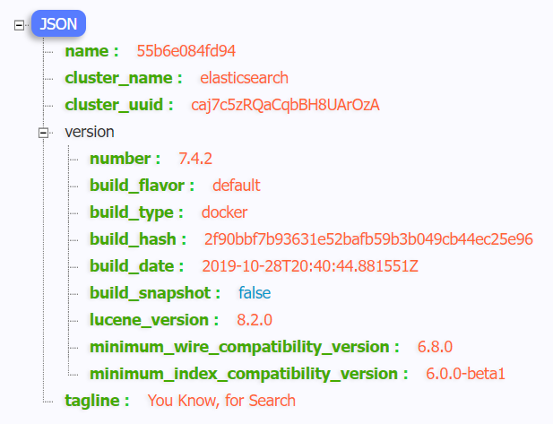

# 一、介绍及安装

## 1.索引、类型、文档

## 2.倒排索引

​	 

## 3.Docker安装Elasticsearch、Kibana

### 3.1下载镜像文件

```shell
# 存储和检索数据
docker pull elasticsearch:7.4.2

# 可视化检索数据
docker pull kibana:7.4.2
```

### 3.2 配置挂载数据文件夹

```shell
# 创建配置文件目录
mkdir -p /mydata/elasticsearch/config

# 创建数据目录
mkdir -p /mydata/elasticsearch/data

# 将/mydata/elasticsearch/文件夹中文件都可读可写
chmod -R 777 /mydata/elasticsearch/

# 配置任意机器可以访问 elasticsearch
echo "http.host: 0.0.0.0" >/mydata/elasticsearch/config/elasticsearch.yml
```

### 3.3启动Elasticsearch

命令后面的 \是换行符，注意前面有空格

```shell
docker run --name elasticsearch -p 9200:9200 -p 9300:9300 \
-e  "discovery.type=single-node" \
-e ES_JAVA_OPTS="-Xms64m -Xmx512m" \
-v /mydata/elasticsearch/config/elasticsearch.yml:/usr/share/elasticsearch/config/elasticsearch.yml \
-v /mydata/elasticsearch/data:/usr/share/elasticsearch/data \
-v  /mydata/elasticsearch/plugins:/usr/share/elasticsearch/plugins \
-d elasticsearch:7.4.2
```

- `-p 9200:9200 -p 9300:9300`：向外暴露两个端口，9200用于HTTP REST API请求，9300 ES 在分布式集群状态下 ES 之间的通信端口；
- `-e  "discovery.type=single-node"`：es 以单节点运行
- `-e ES_JAVA_OPTS="-Xms64m -Xmx512m"`：设置启动占用内存，不设置可能会占用当前系统所有内存
- -v：挂载容器中的配置文件、数据文件、插件数据到本机的文件夹；
- `-d elasticsearch:7.4.2`：指定要启动的镜像

访问 IP:9200 看到返回的 json 数据说明启动成功。

 

### 3.4设置 Elasticsearch 随Docker启动

```shell
# 当前 Docker 开机自启，所以 ES 现在也是开机自启
docker update elasticsearch --restart=always
```

### 3.5启动可视化Kibana

```shell
docker run --name kibana \
-e ELASTICSEARCH_HOSTS=http://ip:9200 \
-p 5601:5601 \
-d kibana:7.4.2

docker run --name kibana \
-e ELASTICSEARCH_HOSTS=http://43.143.198.2:9200 \
-p 5601:5601 \
-d kibana:7.4.2
```

**浏览器输入**192.168.163.131:5601 测试。

 

### 3.6设置 Kibana 随Docker启动

```shell
# 当前 Docker 开机自启，所以 kibana 现在也是开机自启
docker update kibana --restart=always
```

