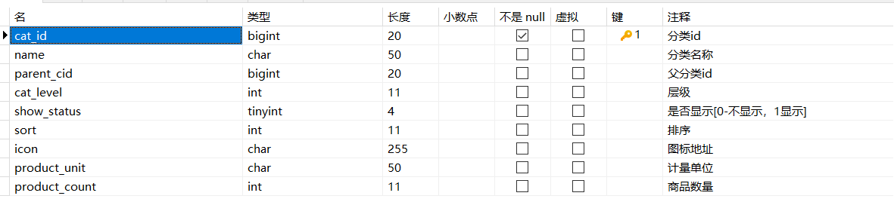

# 查询-递归树形结构数据获取

表：pms_category



Controller

```java
@RestController
@RequestMapping("/category")
public class CategoryController {

    @Autowired
    CategoryService categoryService;

    /**
     * 全部分类信息，以树形结构展示
     */
    @RequestMapping("/list/tree")
    public R listWithTree(){
        return R.ok().put("data", categoryService.listWithTree());
    }
}
```

Service

```java

/**
* @author HAIBIN
* @description 针对表【pms_category(商品三级分类)】的数据库操作Service
* @createDate 2024-01-12 14:48:19
*/
public interface CategoryService extends IService<Category> {

    List<Category> listWithTree();
}
```

Impl

```java
/**
* @author HAIBIN
* @description 针对表【pms_category(商品三级分类)】的数据库操作Service实现
* @createDate 2024-01-12 14:48:19
*/
@Service
public class CategoryServiceImpl extends ServiceImpl<CategoryMapper, Category>
    implements CategoryService{

    @Autowired
    private CategoryMapper categoryMapper;

    @Override
    public List<Category> listWithTree() {
        // 查出所有菜单
        List<Category> retList = categoryMapper.selectList(null);
        // 组装菜单成树状结构
        List<Category> list = retList.stream()
                // 过滤出所有顶级菜单
                .filter(category -> category.getParentCid() == 0)
                // 查找子菜单
                .map((category) -> {
                    category.setChildren(getChildren(category, retList));
                    return category;
                })
                // 按照菜单优先级排序
                .sorted(Comparator.comparingInt(Category::getSort))
                .collect(Collectors.toList());
        return list;
    }

    /**
    递归查找子菜单
    */
    private List<Category> getChildren(Category root, List<Category> all) {
        List<Category> children = all.stream()
                .filter(category -> category.getParentCid().equals(root.getCatId()))
                .map(category -> {
                    category.setChildren(getChildren(category, all));
                    return category;
                })
                .sorted(Comparator.comparingInt(Category::getSort))
                .collect(Collectors.toList());
        return children;
    }
}
```

Category

```java
    /**
     * 	对应的子分类，表中不存在的字段
     * 	如果为空(三级菜单没有孩子)，则返回给前端时序列化时不包含此字段
     */
    @JsonInclude(value = JsonInclude.Include.NON_EMPTY)
    @TableField(exist = false)
    private List<Category> children;
```

PostMan

```
localhost:9002/category/list/tree
```

查询结果展示（部分）：

```
{
    "msg": "success",
    "code": 0,
    "data": [
        {
            "catId": 1,
            "name": "图书、音像、电子书刊",
            "parentCid": 0,
            "catLevel": 1,
            "showStatus": 1,
            "sort": 0,
            "icon": null,
            "productUnit": null,
            "productCount": 0,
            "children": [
                {
                    "catId": 22,
                    "name": "电子书刊",
                    "parentCid": 1,
                    "catLevel": 2,
                    "showStatus": 1,
                    "sort": 0,
                    "icon": null,
                    "productUnit": null,
                    "productCount": 0,
                    "children": [
                        {
                            "catId": 165,
                            "name": "电子书",
                            "parentCid": 22,
                            "catLevel": 3,
                            "showStatus": 1,
                            "sort": 0,
                            "icon": null,
                            "productUnit": null,
                            "productCount": 0
                        },
                        {
                            "catId": 166,
                            "name": "网络原创",
                            "parentCid": 22,
                            "catLevel": 3,
                            "showStatus": 1,
                            "sort": 0,
                            "icon": null,
                            "productUnit": null,
                            "productCount": 0
                        },
                        {
                            "catId": 167,
                            "name": "数字杂志",
                            "parentCid": 22,
                            "catLevel": 3,
                            "showStatus": 1,
                            "sort": 0,
                            "icon": null,
                            "productUnit": null,
                            "productCount": 0
                        },
                        {
                            "catId": 168,
                            "name": "多媒体图书",
                            "parentCid": 22,
                            "catLevel": 3,
                            "showStatus": 1,
                            "sort": 0,
                            "icon": null,
                            "productUnit": null,
                            "productCount": 0
                        }
                    ]
                }
            ]
        }
    ]
}
```

# 配置网关路由与路径重写

登录人人后台管理系统

新增一级目录-商品系统

新增菜单-分类维护，url:product/category

人人后台管理系统中，views/modules文件下sys下有role.vue,所以创建新页面就按照这种格式。

比如product/category页面，就在views/modules/product/category.vue

使用vue模板快速生成vue文件

插入elementui树形组件,删除写死的data数据。

```vue
<template>
<el-tree :data="data" :props="defaultProps" @node-click="handleNodeClick"></el-tree>
</template>

<script>
 export default {
    data() {
      return {
        data: [],
        defaultProps: {
          children: 'children',
          label: 'label'
        }
      };
    },
    methods: {
      handleNodeClick(data) {
        console.log(data);
      }
    }
  };
</script>

<style lang="scss" scoped>

</style>
```

仿照其他页面请求写获取菜单数据请求：

```js
methods: {
    handleNodeClick(data) {
      console.log(data);
    },
    // 获取菜单数据
    getMenus() {
      this.$http({
        url: this.$http.adornUrl("/product/category/list/tree"),
        method: "get"
      }).then(({ data }) => {
        console.log("成功获取到菜单数据...", data);
      });
    }
  },
  created() {
    this.getMenus();
  }
```

到前端页面发现报错404：

```
http://localhost:8080/renren-fast/product/category/list/tree
```

问题如下：

1. product模块端口号9002，不应该向8080发送请求
2. 也不应该向9002发送，应该向网关发送请求

所以全局查找这个localhost:8080/renren-fast，修改localhost:88

修改后还会有问题，因为验证码请求直接发送到88端口，网关哪里有什么验证码接口，所以报错。

```
http://localhost:88/captcha.jpg?uuid=7e324c03-fcff-4510-8ae9-3ec006f802a3
```

怎么办？

将renrenfast注册到nacos,这一步比较简单，不细说了。


网关配置路由规则：

```yaml
spring:
  # 服务名称
  application:
    name: gateway
  cloud:
    gateway:
      routes:
      - id: route_renren_fast
        uri: lb://renren-fast
        predicates:
          - Path=/api/**
```

前端也加上api:http://localhost:88/api

最终验证码请求为:http://localhost:88/api/captcha.jpg?uuid=d05cca9d-8abb-43b9-8510-c41b7938cf37

还是404

为什么？

前端发送：localhost:88/api/captcha.jpg，到网关，网关根据路由规则转发到：renren-fast:8080/api/captcha.jpg

但是实际之前的验证码请求为:renren-fast:8080/renren-fast/captcha.jpg,也就是说多个api,得想办法把api截去。

这里老师提到一个`server.servlet.context-path`配置：/renren-fast

`server.servlet.context-path` 是 Spring Boot 应用中的一个配置项，用于设置应用的上下文路径（Context Path）。上下文路径是应用在 URL 中的基础路径。更改上下文路径意味着你的应用的所有路由都将以这个基础路径为前缀。

如何截去api?使用路径重写：

```yaml
spring:
  # 服务名称
  application:
    name: gateway
  cloud:
    gateway:
      routes:
      - id: route_renren_fast
        uri: lb://renren-fast
        predicates:
          - Path=/api/**
        filters:
          # 路径重写，之前的路由规则都未生效时就转发给/renren-fast进行处理
          - RewritePath=/api(?<segment>/?.*), /renren-fast/$\{segment}
```

启动gateway报错：

```
Description:

Parameter 0 of method modifyRequestBodyGatewayFilterFactory in org.springframework.cloud.gateway.config.GatewayAutoConfiguration required a bean of type 'org.springframework.http.codec.ServerCodecConfigurer' that could not be found.

Action:
Consider defining a bean of type 'org.springframework.http.codec.ServerCodecConfigurer' in your configuration.
```

解决：

删除web依赖：

```xml
<dependency>
    <groupId>org.springframework.boot</groupId>
    <artifactId>spring-boot-starter-web</artifactId>
</dependency>
```

此时验证码正常，继续登录，报错CORS：

```
Access to XMLHttpRequest at 'http://localhost:88/api/sys/login' from origin 'http://localhost:8001' has been blocked by CORS policy: Response to preflight request doesn't pass access control check: No 'Access-Control-Allow-Origin' header is present on the requested resource.
```

# 网关统一配置跨域
[[什么是跨域]]
启动网关、Product、Renren模块，启动前端。

【bug】

启动Product时候，报错了，原因是我把common包里的`spring-boot-starter-web`依赖删掉了，导致Product模块里没有web包，所以连接nacos失败，启动不起来。

【登录报错】

```
:8001/#/:1 Access to XMLHttpRequest at 'http://localhost:88/api/sys/menu/nav?t=1708422545895' from origin 'http://localhost:8001' has been blocked by CORS policy: Response to preflight request doesn't pass access control check: No 'Access-Control-Allow-Origin' header is present on the requested resource.
```

在网关添加配置：

```java
@Configuration
public class GulimallCorsConfiguration {

    /**
     * 非一般请求会先发送optional请求进行跨域试探
     * 利用过滤器对其回应允许跨域
     * @return
     */
    @Bean
    public CorsWebFilter corsWebFilter() {
        UrlBasedCorsConfigurationSource configurationSource = new UrlBasedCorsConfigurationSource();

        // corsConfiguration 处理策略
        CorsConfiguration corsConfiguration = new CorsConfiguration();
        // 注意这里调用的是add方法
        // 允许所有请求头
        corsConfiguration.addAllowedHeader("*");
        // 允许所有来源
        corsConfiguration.addAllowedOrigin("*");
        // 允许所有请求方法
        corsConfiguration.addAllowedMethod("*");
        // 允许携带coolie
        corsConfiguration.setAllowCredentials(true);

        // path 要对哪些请求进行跨域处理；corsConfiguration 处理策略
        configurationSource.registerCorsConfiguration("/**", corsConfiguration);

        // 创建过滤器
        return new CorsWebFilter(configurationSource);
    }
}
```

注释renren模块的重复配置：

```java
@Configuration
public class CorsConfig implements WebMvcConfigurer {

    @Override
    public void addCorsMappings(CorsRegistry registry) {
        registry.addMapping("/**")
            .allowedOrigins("*")
            .allowCredentials(true)
            .allowedMethods("GET", "POST", "PUT", "DELETE", "OPTIONS")
            .maxAge(3600);
    }
}
```

# 查询-树形展示三级分类数据

product路由配置：

```yaml
    gateway:
      routes:
      # 路由到商品管理模块
      - id: route_gulimall_product
        uri: lb://product
        predicates:
          # 根据请求路径路由
          - Path=/api/product/**
        filters:
          # 路径重写
          # 移除了 /api
          - RewritePath=/api(?<segment>/?.*), $\{segment}
```

注意！！！！！

路由是有先后路有顺序的，如果前边的断言匹配上了，就不往后走了，所以注意调整！

越精确的越往前放，越模糊的往后放！ 	

前端修改：

```js
// 赋值
this.menus = data.data

// label 改为name
label: "name"
```

# 删除-页面效果

alt + shift + F 整理代码

```vue
<template>
  <!-- expand-on-click-node	是否在点击节点的时候展开或者收缩节点， 默认值为 true，如果为 false，则只有点箭头图标的时候才会展开或者收缩节点。 -->
  <!-- show-checkbox 节点是否可选择 -->
  <!-- node-key="catId" 节点唯一id -->
  <el-tree
    :data="menus"
    :props="defaultProps"
    :expand-on-click-node="false"
    show-checkbox
    node-key="catId"
  >
    <span class="custom-tree-node" slot-scope="{ node, data }">
      <span>{{ node.label }}</span>
      <span>
        <el-button v-if="node.level <= 2" type="text" size="mini" @click="() => append(data)">
          Append
        </el-button>
        <el-button v-if="node.childNodes.length == 0" type="text" size="mini" @click="() => remove(node, data)">
          Delete
        </el-button>
      </span>
    </span>
  </el-tree>
</template>

<script>
export default {
  data() {
    return {
      menus: [],
      defaultProps: {
        children: "children",
        label: "name"
      }
    };
  },
  methods: {
    append(data) {
      console.log("append", data);
    },

    remove(node, data) {
      console.log("remove", node, data);
    },
    // 获取菜单数据
    getMenus() {
      this.$http({
        url: this.$http.adornUrl("/product/category/list/tree"),
        method: "get"
      }).then(({ data }) => {
        console.log("成功获取到菜单数据...", data.data);
        this.menus = data.data;
      });
    }
  },
  created() {
    this.getMenus();
  }
};
</script>

<style lang="scss" scoped></style>

```

# 删除-逻辑删除

MyBatisPlus逻辑删除文档：https://baomidou.com/pages/6b03c5/#%E4%BD%BF%E7%94%A8%E6%96%B9%E6%B3%95

# 删除-删除效果细化

```vue
<template>
  <!-- expand-on-click-node	是否在点击节点的时候展开或者收缩节点， 默认值为 true，如果为 false，则只有点箭头图标的时候才会展开或者收缩节点。 -->
  <!-- show-checkbox 节点是否可选择 -->
  <!-- node-key="catId" 节点唯一id -->
  <el-tree
    :data="menus"
    :props="defaultProps"
    :expand-on-click-node="false"
    show-checkbox
    node-key="catId"
    :default-expanded-keys="expandedKeys"
  >
    <span class="custom-tree-node" slot-scope="{ node, data }">
      <span>{{ node.label }}</span>
      <span>
        <el-button
          v-if="node.level <= 2"
          type="text"
          size="mini"
          @click="() => append(data)"
        >
          Append
        </el-button>
        <el-button
          v-if="node.childNodes.length == 0"
          type="text"
          size="mini"
          @click="() => remove(node, data)"
        >
          Delete
        </el-button>
      </span>
    </span>
  </el-tree>
</template>

<script>
export default {
  data() {
    return {
      // 默认要展开的节点
      expandedKeys: [],
      menus: [],
      defaultProps: {
        children: "children",
        label: "name"
      }
    };
  },
  methods: {
    append(data) {
      console.log("append", data);
    },

    remove(node, data) {
      console.log("remove-->", node, data);
      // 弹出确认提示框
      // 点击确定后发送删除请求
      // 删除成功后弹出提示信息
      // 重新从后端获取菜单列表
      // 自动展开父级菜单
      // 注意此处的反引号
      this.$confirm(`是否删除【${data.name}】菜单项?`, "提示", {
        confirmButtonText: "确定",
        cancelButtonText: "取消",
        type: "warning"
        //   点击确定
      })
        .then(() => {
          let ids = [data.catId];
          console.log(data.catId);
          // 发送httppost请求，进行删除
          this.$http({
            url: this.$http.adornUrl("/product/category/delete"),
            method: "post",
            data: this.$http.adornData(ids, false)
          }).then(({ data }) => {
            // 删除成功弹出提示框
            this.$message({
              type: "success",
              message: "删除成功!"
            });
            // 重新获取菜单列表
            this.getMenus();
            // 展开父级菜单
            this.expandedKeys = [node.parent.data.catId];
          });
        })
        .catch(() => {
          this.$message({
            type: "info",
            message: "已取消删除"
          });
        });
    },
    // 获取菜单数据
    getMenus() {
      this.$http({
        url: this.$http.adornUrl("/product/category/list/tree"),
        method: "get"
      }).then(({ data }) => {
        console.log("成功获取到菜单数据...", data.data);
        this.menus = data.data;
      });
    }
  },
  created() {
    this.getMenus();
  }
};
</script>

<style lang="scss" scoped></style>

```

# 新增-新增效果完成

对话框：https://element.eleme.cn/#/zh-CN/component/dialog

```vue
<template>
  <div>
    <!-- expand-on-click-node	是否在点击节点的时候展开或者收缩节点， 默认值为 true，如果为 false，则只有点箭头图标的时候才会展开或者收缩节点。 -->
    <!-- show-checkbox 节点是否可选择 -->
    <!-- node-key="catId" 节点唯一id -->
    <el-tree
      :data="menus"
      :props="defaultProps"
      :expand-on-click-node="false"
      show-checkbox
      node-key="catId"
      :default-expanded-keys="expandedKeys"
    >
      <span class="custom-tree-node" slot-scope="{ node, data }">
        <span>{{ node.label }}</span>
        <span>
          <el-button
            v-if="node.level <= 2"
            type="text"
            size="mini"
            @click="() => append(data)"
          >
            Append
          </el-button>
          <el-button
            v-if="node.childNodes.length == 0"
            type="text"
            size="mini"
            @click="() => remove(node, data)"
          >
            Delete
          </el-button>
        </span>
      </span>
    </el-tree>

    <!-- 新增菜单弹出对话框 -->
    <el-dialog title="提示" :visible.sync="dialogVisible" width="30%">
      <el-form :model="category">
        <el-form-item label="分类名称">
          <el-input v-model="category.name" autocomplete="off"></el-input>
        </el-form-item>
      </el-form>
      <span slot="footer" class="dialog-footer">
        <el-button @click="dialogVisible = false">取 消</el-button>
        <el-button type="primary" @click="addCategory"
          >确 定</el-button
        >
      </span>
    </el-dialog>
  </div>
</template>

<script>
export default {
  data() {
    return {
      // 默认要展开的节点
      expandedKeys: [],
      menus: [],
      defaultProps: {
        children: "children",
        label: "name"
      },
      // 是否显示对话框
      dialogVisible: false,
      category: {
        // catId由数据库自己生成
        catId: null,
        name: "",
        parentCid: 0,
        catLevel: 0,
        showStatus: 1,
        icon: "",
        productUnit: "",
        sort: 0
      }
    };
  },
  methods: {
    // 在表单数据准备好后发起post请求添加菜单
    addCategory() {
      // 发起httppost请求，将表单数据提交到后台
      this.$http({
        url: this.$http.adornUrl("/product/category/save"),
        method: "post",
        data: this.$http.adornData(this.category, false),
      }).then(({ data }) => {
        // 弹出消息提示框
        // 删除成功弹出提示框
        this.$message({
          type: "success",
          message: "添加成功!",
        });
        // 关闭对话框
        this.dialogVisible = false;
        // 重新获取全部菜单列表
        this.getMenus();
        // 设置默认展开的菜单节点(自己)
        this.expandedKeys = [this.category.parentCid];
      });
    },
    append(data) {
      console.log("append", data);
      // 弹出填写框
      this.dialogVisible = true;
      // 为表单对象复制，name属性是双向绑定，不用手动赋值
      this.category.parentCid = data.catId;
      // *1 可以自动转型
      this.category.catLevel = data.catLevel * 1 + 1;
    },

    remove(node, data) {
      console.log("remove-->", node, data);
      // 弹出确认提示框
      // 点击确定后发送删除请求
      // 删除成功后弹出提示信息
      // 重新从后端获取菜单列表
      // 自动展开父级菜单
      // 注意此处的反引号
      this.$confirm(`是否删除【${data.name}】菜单项?`, "提示", {
        confirmButtonText: "确定",
        cancelButtonText: "取消",
        type: "warning"
        //   点击确定
      })
        .then(() => {
          let ids = [data.catId];
          console.log(data.catId);
          // 发送httppost请求，进行删除
          this.$http({
            url: this.$http.adornUrl("/product/category/delete"),
            method: "post",
            data: this.$http.adornData(ids, false)
          }).then(({ data }) => {
            // 删除成功弹出提示框
            this.$message({
              type: "success",
              message: "删除成功!"
            });
            // 重新获取菜单列表
            this.getMenus();
            // 展开父级菜单
            this.expandedKeys = [node.parent.data.catId];
          });
        })
        .catch(() => {
          this.$message({
            type: "info",
            message: "已取消删除"
          });
        });
    },
    // 获取菜单数据
    getMenus() {
      this.$http({
        url: this.$http.adornUrl("/product/category/list/tree"),
        method: "get"
      }).then(({ data }) => {
        console.log("成功获取到菜单数据...", data.data);
        this.menus = data.data;
      });
    }
  },
  created() {
    this.getMenus();
  }
};
</script>

<style lang="scss" scoped></style>

```


# P53.修改-基本修改效果完成

```vue
<template>
  <div>
    <!-- expand-on-click-node	是否在点击节点的时候展开或者收缩节点， 默认值为 true，如果为 false，则只有点箭头图标的时候才会展开或者收缩节点。 -->
    <!-- show-checkbox 节点是否可选择 -->
    <!-- node-key="catId" 节点唯一id -->
    <el-tree
      :data="menus"
      :props="defaultProps"
      :expand-on-click-node="false"
      show-checkbox
      node-key="catId"
      :default-expanded-keys="expandedKeys"
    >
      <span class="custom-tree-node" slot-scope="{ node, data }">
        <span>{{ node.label }}</span>
        <span>
          <el-button
            v-if="node.level <= 2"
            type="text"
            size="mini"
            @click="() => append(data)"
          >
            Append
          </el-button>

          <el-button type="text" size="mini" @click="() => edit(node, data)">
            Edit
          </el-button>

          <el-button
            v-if="node.childNodes.length == 0"
            type="text"
            size="mini"
            @click="() => remove(node, data)"
          >
            Delete
          </el-button>
        </span>
      </span>
    </el-tree>

    <!-- 新增菜单弹出对话框 -->
    <el-dialog
      :title="title"
      :visible.sync="dialogVisible"
      width="30%"
      :close-on-click-modal="false"
      :show-close="false"
    >
      <el-form :model="category">
        <el-form-item label="分类名称">
          <el-input v-model="category.name" autocomplete="off"></el-input>
        </el-form-item>
        <el-form-item label="菜单图标">
          <el-input v-model="category.icon" autocomplete="off"></el-input>
        </el-form-item>
        <el-form-item label="计量单位">
          <el-input
            v-model="category.productUnit"
            autocomplete="off"
          ></el-input>
        </el-form-item>
      </el-form>
      <span slot="footer" class="dialog-footer">
        <el-button @click="dialogVisible = false">取 消</el-button>
        <el-button type="primary" @click="submitData()">确 定</el-button>
      </span>
    </el-dialog>
  </div>
</template>

<script>
export default {
  data() {
    return {
      title: "",
      // 默认要展开的节点
      expandedKeys: [],
      menus: [],
      defaultProps: {
        children: "children",
        label: "name"
      },
      // 是否显示对话框
      dialogVisible: false,
      category: {
        // catId由数据库自己生成
        catId: null,
        name: "",
        parentCid: 0,
        catLevel: 0,
        showStatus: 1,
        icon: "",
        productUnit: "",
        sort: 0
      },
      // 添加和修改共用一个对话框，需要一个变量来区别点击确定时进行添加还是修改操作
      dialogType: ""
    };
  },
  methods: {
    submitData() {
      if (this.dialogType == "add") {
        this.addCategory();
      }
      if (this.dialogType == "edit") {
        this.editCategory();
      }
    },
    editCategory() {
      var { catId, name, icon, productUnit } = this.category;
      this.$http({
        url: this.$http.adornUrl("/product/category/update"),
        method: "post",
        data: this.$http.adornData({ catId, name, icon, productUnit }, false)
      }).then(({ data }) => {
        // 修改成功弹出提示框
        this.$message({
          type: "success",
          message: "修改成功!"
        });
        // 关闭对话框
        this.dialogVisible = false;
        // 重新获取全部菜单列表
        this.getMenus();
        // 设置默认展开的菜单节点(自己)
        this.expandedKeys = [this.category.parentCid];
      });
    },
    // 在表单数据准备好后发起post请求添加菜单
    addCategory() {
      // 发起httppost请求，将表单数据提交到后台
      this.$http({
        url: this.$http.adornUrl("/product/category/save"),
        method: "post",
        data: this.$http.adornData(this.category, false)
      }).then(({ data }) => {
        // 弹出消息提示框
        // 删除成功弹出提示框
        this.$message({
          type: "success",
          message: "添加成功!"
        });
        // 关闭对话框
        this.dialogVisible = false;
        // 重新获取全部菜单列表
        this.getMenus();
        // 设置默认展开的菜单节点(自己)
        this.expandedKeys = [this.category.parentCid];
      });
    },
    append(data) {
      console.log("append", data);
      // 弹出填写框
      this.dialogVisible = true;
      // 对话框标题
      this.title = "添加菜单";
      // 设置当前是添加操作
      this.dialogType = "add";
      // 为表单对象复制，name属性是双向绑定，不用手动赋值
      this.category.parentCid = data.catId;
      // *1 可以自动转型
      this.category.catId = null;
      this.category.name = "";
      this.category.icon = "";
      this.category.productUnit = "";
      this.category.sort = 0;
      this.category.showStatus = 1;
    },
    edit(node, data) {
      console.log("edit-->", data);
      // 弹出对话框
      this.dialogVisible = true;
      // 回显
      // 当前菜单(节点)的数据回显(表单绑定的是category对象，我们需要去数据库重新获取它，防止缓存)
      this.$http({
        url: this.$http.adornUrl("/product/category/info/" + data.catId),
        method: "get"
      }).then(({ data }) => {
        console.log("最新的category", data);
        // // 把最新数据赋值给表单对象
        // this.category = data.category;
        this.category.name = data.data.name;
        this.category.catId = data.data.catId;
        this.category.icon = data.data.icon;
        this.category.productUnit = data.data.productUnit;
        this.category.parentCid = data.data.parentCid;
      });
      // 设置当前是添加操作
      this.dialogType = "edit";
      // 设置对话框显示标题
      this.title = "修改菜单";
    },
    remove(node, data) {
      console.log("remove-->", node, data);
      // 弹出确认提示框
      // 点击确定后发送删除请求
      // 删除成功后弹出提示信息
      // 重新从后端获取菜单列表
      // 自动展开父级菜单
      // 注意此处的反引号
      this.$confirm(`是否删除【${data.name}】菜单项?`, "提示", {
        confirmButtonText: "确定",
        cancelButtonText: "取消",
        type: "warning"
        //   点击确定
      })
        .then(() => {
          let ids = [data.catId];
          console.log(data.catId);
          // 发送httppost请求，进行删除
          this.$http({
            url: this.$http.adornUrl("/product/category/delete"),
            method: "post",
            data: this.$http.adornData(ids, false)
          }).then(({ data }) => {
            // 删除成功弹出提示框
            this.$message({
              type: "success",
              message: "删除成功!"
            });
            // 重新获取菜单列表
            this.getMenus();
            // 展开父级菜单
            this.expandedKeys = [node.parent.data.catId];
          });
        })
        .catch(() => {
          this.$message({
            type: "info",
            message: "已取消删除"
          });
        });
    },
    // 获取菜单数据
    getMenus() {
      this.$http({
        url: this.$http.adornUrl("/product/category/list/tree"),
        method: "get"
      }).then(({ data }) => {
        console.log("成功获取到菜单数据...", data.data);
        this.menus = data.data;
      });
    }
  },
  created() {
    this.getMenus();
  }
};
</script>

<style lang="scss" scoped></style>

```

# P54-58略